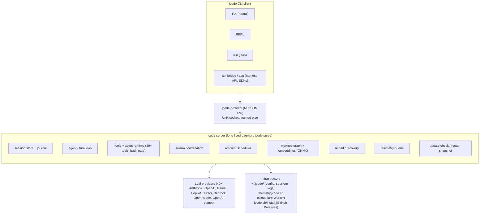
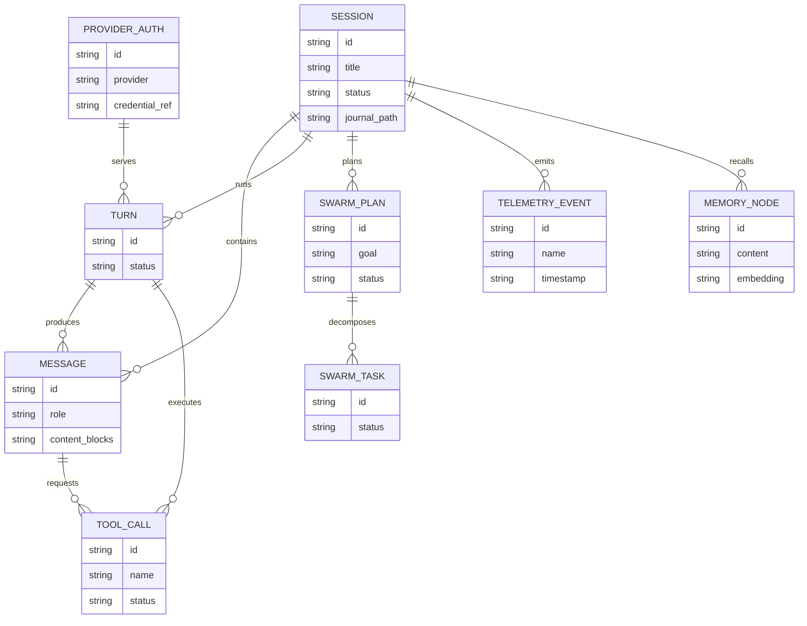

# Architecture

## System overview

## Entity relationship diagram

- Relationships are inferred from the session, turn loop, tool runtime, swarm, memory, provider, and telemetry code.
- The full detailed database schema (types, constraints, indexes) lives in `schema.dbml` when the project uses a database.

## Key components

| Component | Responsibility | Technology |
|---|---|---|
| `jcode` CLI / client | Parse subcommands, spawn or connect to the server, present TUI/REPL/`run` output | Rust + clap, ratatui TUI |
| `jcode serve` daemon | Long-lived server owning sessions, agents, tools, swarm, memory, ambient mode | Rust, tokio, in `jcode-app-core` |
| `jcode-protocol` | Client-server wire protocol: `Request`/`ServerEvent`, NDJSON framing over Unix socket / named pipe | Rust, serde, NDJSON |
| `jcode-app-core` | Application core: server, agent/turn loops, tools, swarm, ambient, background tasks | Rust, `jcode-base` re-exported |
| `jcode-base` | Foundational downward-closed layer: provider, auth, config, session, message, memory, telemetry, transport | Rust |
| `jcode-tui` | Presentation layer: TUI widgets + offline video replay (`jcode replay`) | Rust, ratatui, crossterm |
| `jcode-provider-*` | Per-provider config, catalog, and runtime implementations | Rust (Anthropic, OpenAI, Gemini, Bedrock, Copilot, Cursor, OpenRouter, Antigravity, Claude CLI) |
| `jcode-harness-api` / `jcode-sdk` | Stable versioned client API for the harness; Rust SDK | Rust |
| `jcode-harness-api-server` | `jcode api-bridge`: bridges versioned API clients onto the internal protocol | Rust, Unix socket |
| `jcode-desktop2` | Greenfield desktop companion app | Rust, winit + wgpu + Vello + Parley |
| `ios/` (JCodeKit, JCodeMobile) | Native iOS companion app with gateway pairing | Swift, SwiftUI |
| `telemetry-worker/` | Server-side telemetry ingestion and analytics | Cloudflare Worker + D1 |
| Installers / launcher | Multi-platform install and self-update | Bash, PowerShell, npm launcher packages |

## Data flow

- A user starts a session: the client connects to the server over the protocol socket, subscribes to events, and sends a message.
- The server runs the agent turn loop, which calls the selected provider runtime (streaming deltas back as `ServerEvent`s), executes tool calls through the agent runtime, and appends every message to the session journal (`~/.jcode/sessions/<id>.json` snapshot plus `<id>.journal.jsonl` append log).
- Compaction and memory injection happen inside the turn loop.
- Memory embeddings are computed locally with an ONNX MiniLM model.
- Swarm and ambient work run as background tasks on the same server, publishing progress events to subscribed clients.
- Telemetry events are queued in the client and flushed to `telemetry.jcode.sh/v1/event` (opt-out via env var or file marker).
- Auto-update checks GitHub releases and hot-reloads the server into a new binary without dropping sessions.

## Infrastructure

- Hosting and deployment topology is summarized below.
- Detailed technology stack, development tooling, CI/CD pipelines, environments, deployment procedures, and rollback live in `infrastructure.md`.
- Monitoring stack, alerting, and dashboards live in `observability.md`.
- CI: GitHub Actions (`.github/workflows/ci.yml` is the main gate: fmt, clippy `-D warnings`, budget ratchets, cross-platform build/test matrix for Linux/macOS/Windows, TypeScript SDK, iOS TestFlight, security scans).
- Release builds run via `release.yml`.
- Distribution: GitHub Releases (tagged `v<version>`), `https://jcode.sh/install` for the install script, npm platform launcher packages, `RELEASING.md` documents quick (local) and CI release flows.
- Observability: telemetry pipeline (`TELEMETRY.md`, `telemetry-worker/` D1 schema + dashboards) plus file logging to `~/.jcode/logs` (not stderr).
- Storage: local-first under `~/.jcode/` (config.toml, sessions, auth, logs, durable state), sockets under the runtime dir.
- Release channels: stable and main update channels.
- Immutable versioned binaries live under `~/.jcode/builds/versions/<version>/`.

## Architecture decisions

- Key architectural decisions are documented in `docs/` (for example `SERVER_ARCHITECTURE.md`, `MODULAR_ARCHITECTURE_RFC.md`, `CRATE_OWNERSHIP_BOUNDARIES.md`, `HARNESS_API_AND_DESKTOP_REWRITE.md`) and the code comments in `Cargo.toml`.
- Formal decision records, once captured, live under `.sdlc/knowledge/decisions/`.
