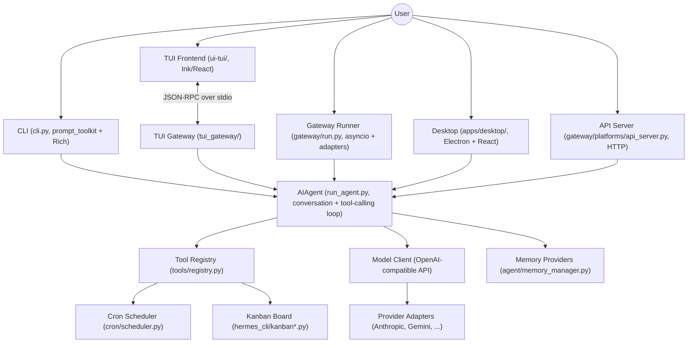
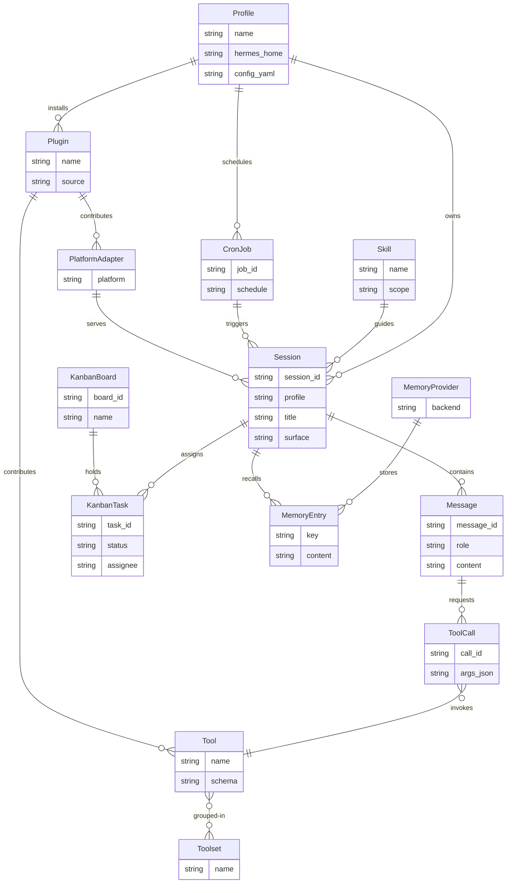

# Architecture

## System Overview

## Key Components

| Component | Responsibility | Technology |
|---|---|---|
| AIAgent (run_agent.py) | Core conversation loop — manages chat completions API calls, tool-calling iterations, interrupt handling, budget tracking, subagent spawning | Python, OpenAI SDK |
| HermesCLI (cli.py) | Interactive CLI orchestrator with prompt_toolkit REPL, Rich panels, skin engine, slash command dispatch (~70 commands) | Python, prompt_toolkit, Rich |
| Tool Registry (tools/registry.py) | Central registry for tool schemas and handlers with a dispatch() entry point, auto-discovering tools from tools/*.py at import time | Python |
| Tool Implementations (tools/*.py) | ~260 tool modules including topical facade siblings — terminal, file, web, browser, vision, delegation, cron, kanban, etc., each self-registering at import time | Python |
| Toolset Definitions (toolsets.py) | Composable tool groupings for platforms and scenarios (hermes-cli, hermes-telegram, web, browser, file, etc.) | Python |
| Model Tools (model_tools.py) | Orchestration layer — tool discovery, schema collection, handle_function_call() dispatch, gating, MCP integration, approval gates | Python |
| Gateway Runner (gateway/run.py) | Async runtime for all messaging platforms — session lifecycle, stream dispatch, approval flow, slash command dispatch, structured as a facade with run_*.py siblings | Python, asyncio |
| Platform Adapters (gateway/platforms/ + plugins/platforms/) | Base adapter ABC, shared ingress helpers, and some in-tree adapters (Signal, webhook, API server, Weixin, WhatsApp Cloud, etc.) stay in gateway/platforms/, while the 22 canonical per-platform adapters (Telegram, Discord, Slack, Matrix, email, SMS, etc.) live under plugins/platforms/ | Python |
| TUI Frontend (ui-tui/) | Ink (React) terminal UI with composer, transcript, session picker, slash commands | TypeScript, Ink, React |
| TUI Gateway (tui_gateway/) | Python JSON-RPC backend over stdio serving the TUI frontend | Python |
| Electron Desktop (apps/desktop/) | Standalone Electron desktop app with its own React composer and slash-command pipeline | TypeScript, Electron, React, nanostores |
| Plugin Manager (hermes_cli/plugins.py) | Discovers and manages plugins (hooks, tools, CLI subcommands) from ~/.hermes/plugins/ and pip entry points | Python |
| Memory Manager (agent/memory_manager.py) | Orchestrates pluggable memory backends via MemoryProvider ABC with per-turn sync_turn() | Python |
| Cron Scheduler (cron/scheduler.py) | Tick loop for scheduled jobs — duration, cron expressions, ISO timestamps | Python |
| Curator (agent/curator.py) | Background skill lifecycle maintenance — tracks usage, auto-archives stale agent-created skills | Python |
| Configuration System (hermes_cli/config.py) | config.yaml with deep-merge from DEFAULT_CONFIG, profile-aware paths, .env for secrets only | Python |
| Session Store (hermes_state.py + hermes_state_*.py) | SQLite database with FTS5 full-text search for conversation history, structured as a SessionDB facade with ~28 topical siblings | Python, SQLite |
| Kanban Board (hermes_cli/kanban*.py, tools/kanban_tools.py) | Durable SQLite-backed multi-agent work queue — boards, tasks, assignees, claims, comments, attachments, dependency links, with the dispatcher running inside the gateway by default | Python |
| Observer Hooks (plugins/observability/) | Backend-neutral telemetry contract (trace/metric/audit/replay/export) consumed by the Langfuse plugin | Python |

## Data Flow

1. **Message arrives** via any surface (CLI, messaging platform, TUI, desktop, API server).
2. **System prompt is built** from config, skills, memory, personality — built once per session for prompt caching stability.
3. **Conversation loop** in AIAgent.run_conversation().
4. **Model call** sends messages (system + history + user) with tool schemas to the LLM provider via OpenAI-compatible API.
5. **Tool calls dispatch** each call to handle_function_call() via registry.dispatch(), append tool results, and repeat the loop.
6. **Text responses return** directly as the final response when the model makes no tool calls.
7. **Agent-level interception** in run_agent.py handles memory and todo calls before reaching the registry.
8. **Response delivered** back through the originating surface (CLI prints it, gateway sends platform message, TUI streams delta).
9. **Post-turn** — memory providers sync_turn(), title generation fires, trajectory may be saved.

## Entity Relationship Diagram

## Infrastructure

- Canonical environment, deployment, packaging, and CI topology detail lives in infrastructure.md.
- Canonical logging, metrics, tracing, and telemetry detail lives in observability.md.
- Tests run through the hermetic runner (scripts/run_tests.sh) with per-file subprocess isolation and per-test temp HERMES_HOME, plus a vitest suite under tests-js/ for JS/TS code.
- Dependencies carry upper bounds via uv, and long-lived conversations preserve prompt caching by keeping the system prompt byte-stable.

## Architecture Decisions

Key decisions are documented in the AGENTS.md file and the convention is to avoid adding new core tools when capability can live at the edges. Formal ADRs live under `.sdlc/knowledge/decisions/` once created.
