# Architecture

## System Overview

Fusion is a monorepo of TypeScript packages where a React dashboard SPA (with an embedded Express API server) and a terminal CLI/TUI both drive a shared domain model and task store. An engine package performs the automated work (triage, scheduling, execution, review, merge, self-healing), and a set of shells (desktop Electron, mobile Capacitor) wrap the dashboard. Only the CLI package is published; the private packages are bundled into it.

```
┌────────────────────────────────────────────────────────────────────────┐
│  Surfaces                                                                │
│  Dashboard SPA (React)   CLI/TUI (fn)   Desktop (Electron)   Mobile     │
│  ────────────────────────────────────────────────────────────────────  │
│  @fusion/dashboard  (web UI + Express API, domain routes, /api/events)  │
└──────────────┬─────────────────────────────────────────────────────────┘
               │  static imports / REST + SSE event bus
┌──────────────▼─────────────────────────────────────────────────────────┐
│  @fusion/core  (domain model + task store: task-store/, workflows/,     │
│                planner/, agents/, missions/, goals/, research/,         │
│                secrets/, config/settings, mesh/, plugins/)              │
└──────────────┬─────────────────────────────────────────────────────────┘
               │  Domain API (no raw DB access outside core)
┌──────────────▼─────────────────────────────────────────────────────────┐
│  @fusion/engine  (scheduler, triage, executor, merger, review,          │
│                   workflow-graph execution, self-healing, sandbox,      │
│                   agent heartbeat)                                       │
└──────────────┬─────────────────────────────────────────────────────────┘
               │
      ┌────────▼────────┐      ┌─────────────────────┐
      │ PostgreSQL      │      │ Git worktrees /     │
      │ (embedded/runtime│      │ remote PRs (GitHub  │
      │  storage)        │      │  / GitLab)          │
      └─────────────────┘      └─────────────────────┘
```

## Entity Relationship Diagram

```mermaid
erDiagram
    tasks ||--o{ task_documents : "has"
    tasks ||--o{ artifacts : "has"
    tasks ||--o{ activity_log : "triggers"
    tasks ||--o{ agents : "bound_to"
    tasks ||--o{ merge_queue : "queued_in"
    tasks ||--o{ merge_requests : "merges_via"
    tasks ||--o{ workflow_work_items : "instantiates"
    tasks ||--o{ workflow_run_branches : "lands_in"
    tasks ||--o{ workflow_run_step_instances : "runs"
    tasks ||--o{ ai_sessions : "drives"
    tasks ||--o{ cli_sessions : "drives"
    tasks ||--o{ task_commit_associations : "linked_to_commits"
    tasks ||--o{ usage_events : "records_usage"
    tasks ||--o{ pull_requests : "opens"
    tasks ||--o{ chat_sessions : "discussed_in"
    tasks ||--o{ approval_requests : "requests_approval"
    tasks ||--o{ run_audit_events : "audits"
    tasks ||--o{ mission_features : "implements"
    agents ||--o{ agent_heartbeats : "emits"
    agents ||--o{ agent_runs : "executes"
    agents ||--o{ agent_task_sessions : "sessions"
    agents ||--o{ agent_ratings : "rated_by"
    agents ||--o{ chat_sessions : "chats"
    agents ||--o{ chat_room_members : "joins"
    missions ||--o{ milestones : "contains"
    milestones ||--o{ slices : "contains"
    slices ||--o{ mission_features : "contains"
    missions ||--o{ mission_goals : "linked_to"
    goals ||--o{ mission_goals : "linked_from"
    missions ||--o{ mission_contract_assertions : "validates"
    mission_features ||--o{ mission_validator_runs : "validated_by"
    research_runs ||--o{ research_exports : "exports"
    research_runs ||--o{ research_run_events : "logs"
    eval_runs ||--o{ eval_task_results : "scores"
    eval_runs ||--o{ eval_run_events : "logs"
    experiment_sessions ||--o{ experiment_session_records : "records"
    chat_sessions ||--o{ chat_messages : "contains"
    chat_sessions ||--o{ chat_token_usage : "accounts_for"
    chat_rooms ||--o{ chat_room_members : "members"
    chat_rooms ||--o{ chat_room_messages : "messages"
    pull_requests ||--o{ pull_request_thread_state : "review_threads"
    project_insight_runs ||--o{ project_insight_run_events : "logs"
    mission_validator_runs ||--o{ mission_validator_failures : "produces"
    branch_groups ||--o{ pull_requests : "opens"
    todo_lists ||--o{ todo_items : "contains"
    approval_requests ||--o{ approval_request_audit_events : "audits"
```



## Key Components

| Component | Responsibility | Technology |
|---|---|---|
| `@fusion/dashboard` | React SPA (board, task detail, planning mode, command center) + Express API server with domain registrars | React, Express, i18next, EventSource/SSE |
| `@runfusion/fusion` (CLI) | `fn` command surface, TUI, daemon/serve, pi extension carrier | Node CLI, `pnpm`-packaged, `pi` extension |
| `@fusion/core` | Domain model and task store: tasks, lifecycle moves, workflows IR, planner/overseer state, agents, missions/goals/research, secrets, settings, mesh/projects, plugins | TypeScript, PostgreSQL |
| `@fusion/engine` | Triage, scheduler, executor (agent sessions), merger (squash/rebase/conflict), review service, workflow-graph executor + node runners, self-healing sweeps, agent heartbeat | TypeScript |
| `@fusion/desktop` / `@fusion/mobile` | Native shells wrapping the dashboard SPA via a shared `window.fusionShell` bridge | Electron / Capacitor |
| `@fusion/plugin-sdk`, `plugins/*` | Third-party plugin authoring SDK and bundled plugins | TypeScript |
| `@fusion/i18n` | Locale catalogs shared by dashboard and CLI | i18next |
| `packages/pi-claude-cli`, `packages/droid-cli`, `packages/pi-llama-cpp` | First-party `pi` extensions routing into different coding-agent CLIs | TypeScript |

## Data Flow

Tasks are created via the dashboard, CLI, import, or mission/research flows and stored in `@fusion/core`'s task store (PostgreSQL). The engine's triage and scheduler claim eligible tasks; the executor creates a permission-bounded agent session and drives it in an isolated git worktree. The workflow-graph executor advances the graph through planning/code/review/gate/merge node runners. The merger lands the branch (squash default, rebase/PR paths) into the default branch or drives a GitHub/GitLab PR, guarded by file-scope, lineage, and diff-volume checks. Self-healing sweeps and the scheduler reconcile stranded state. The dashboard receives lifecycle events over a shared `/api/events` SSE bus; external signals (Sentry/Datadog/PagerDuty/webhooks) arrive via HMAC-signed connectors into the Command Center.

## Infrastructure

- **CI/CD:** GitHub Actions (`.github/workflows/`): `pr-checks.yml` (thin merge gate: lint, typecheck, build, gate), `full-suite.yml` (non-blocking on main), plus mobile, desktop-packaging, release, version, and test-release workflows
- **Storage:** PostgreSQL runtime storage (embedded PostgreSQL binaries for local runs; see `docs/storage.md`); file-backed payloads; archives with soft-delete semantics
- **Observability:** structured diagnostic logging (see `docs/diagnostics.md`), run-audit event rows, Command Center health/usage surfaces
- **Packaging:** `pnpm` workspace; desktop/mobile signed binaries (macOS/Windows signing scripts); Docker builds (`Dockerfile`, `docs/docker.md`)
- **Localization:** i18next catalogs across locales (READMEs in ES/FR/KO/ZH)

## Architecture Decisions

Formal records live under `.sdlc/knowledge/decisions/` (empty at initial sync). Key known decisions:
- `@fusion/*` packages stay private and are bundled into the published `@runfusion/fusion`
- Cross-`@fusion/*` imports are statically analyzable; `@fusion/core` injects agent-creation via DI to break the core/engine cycle
- Workflow-graph nodes own plan/code/browser review exclusively (no second review authority inside implementation sessions)
- The merge gate is deliberately thin; broad verification runs non-blocking
- Releasing is operator-only and driven by `pnpm release` (see `scripts/release.mjs`)
