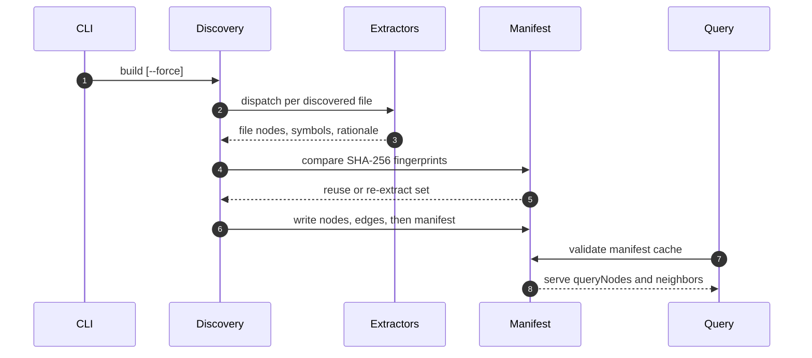
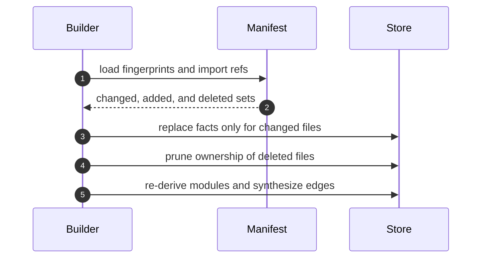

# Specification: Knowledge Graph & Memory

## Overview

The build discovers source, doc, script, plugin, and dashboard files, extracts per-file facts with parser-only extractors, derives module nodes from the final file set, synthesizes import edges from manifest import references, and persists sorted LF JSON for queries.
Incremental rebuilds reuse fingerprints so only changed files are re-extracted.

## Architecture

Discovery in file-discovery.ts feeds per-language extractors behind the extract-file.ts dispatcher, graph-builder.ts assembles nodes and edges, graph-manifest.ts persists fingerprints and import references, and graph-query.ts serves in-process reads.
The inferred-edge-writer.ts module is the sole writer of inferred provenance for Memory Keeper semantics.
The dashboard Memory tab reads through a small manifest-validated artifact cache and never rebuilds implicitly.

## Data Models

### Node

| Field | Type | Constraints | Description |
|---|---|---|---|
| id | string | PK, not null | Path-derived identifier with percent-escaped separators. |
| kind | enum | not null | One of file, module, symbol, doc-concept, or rationale. |
| source | object | not null | Repository-relative path, line, and column anchor. |
| attributes | object | nullable | Symbol kind, declaration count, FNXC stamp, and synthetic flags. |

ID scheme uses file colon path, module colon directory, symbol path hash name, doc path hash slug tilde index, and rationale path hash area at stamp tilde index.

### Edge

| Field | Type | Constraints | Description |
|---|---|---|---|
| kind | enum | not null | Structural contains, imports, and re-exports or semantic relates-to and rationale-supports. |
| source | string | FK to node, not null | Provenance origin of the relationship. |
| owner | enum | not null | Either file or derived ownership. |
| provenance | enum | not null | Either extracted for deterministic facts or inferred for Memory Keeper semantics. |

### Manifest

| Field | Type | Constraints | Description |
|---|---|---|---|
| fingerprints | map | not null | Per-file SHA-256 hashes driving incremental reuse. |
| importRefs | map | not null | Persisted import references used to synthesize edges every build. |

## API Contracts

The normative contract is the in-process query API plus the CLI and dashboard HTTP surface summarized below.

| Method | Path | Purpose |
|---|---|---|
| CLI | `fn knowledge-graph build [--force] [--dir <path>] [--json]` | Builds or rebuilds the graph artifact. |
| GET | /api/knowledge/graph/status | Reports artifact presence and staleness. |
| GET | /api/knowledge/graph/nodes | Returns a capped page of nodes. |
| GET | /api/knowledge/graph/node | Returns one node by identifier. |
| GET | /api/knowledge/graph/neighbors | Returns bounded neighbor edges. |
| GET | /api/knowledge/graph/path | Returns a bounded undirected shortest path. |
| POST | /api/knowledge/graph/build | Triggers an explicit rebuild including force. |

Error codes shared across endpoints:

| Status | Code | Description |
|---|---|---|
| 404 | GRAPH_NOT_BUILT | Artifact is missing and the operator should rebuild explicitly. |
| 404 | NODE_NOT_FOUND | Requested node identifier does not exist in the graph. |
| 400 | INVALID_ARTIFACT | Persisted artifact failed shape validation and a full rebuild is required. |

## Sequences

### Build then extract then manifest then query

### Incremental rebuild

## Technical Decisions

| Decision | Choice | Rationale |
|---|---|---|
| TypeScript parsing | Parser only with no checker | Keeps extraction fast, deterministic, and independent of type resolution. |
| Artifact tracking | Gitignored regenerable directory | Avoids roughly 85MB of compounding history bloat for reproducible output. |
| Serialization | Sorted LF JSON with manifest last | Guarantees stable bytes and makes torn writes fail validation safely. |
| Recovery | Full rebuild on invalid or inconsistent artifact | Prevents partial trust in persisted nodes, edges, or import references. |
| Provenance | Single inferred-edge writer | Stops model output from ever masquerading as deterministic extraction. |

## Risks and Unknowns

1. The roughly 85MB artifact keeps query latency dependent on the manifest-validated cache rather than whole-graph loads.
2. Lexical import resolution cannot follow tsconfig aliases, packages, or expanded export-star names.
3. Duplicate exports collapse to the earliest position, which preserves determinism but loses per-declaration fidelity.
4. Dashboard path queries use a bounded BFS that can report limit-reached instead of a complete path.

## Out of Scope

- LLM calls, embeddings, vector recall, and MCP tools.
- Source-validity diagnostics and CommonMark parsing.
- Languages beyond TypeScript and TSX symbol extraction.
- Cross-rename identity and the deferred FR-29 and FR-34 bundle format.
- Whole-graph force-directed canvas rendering in the dashboard.
