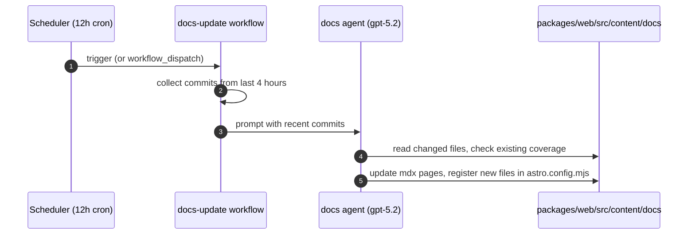
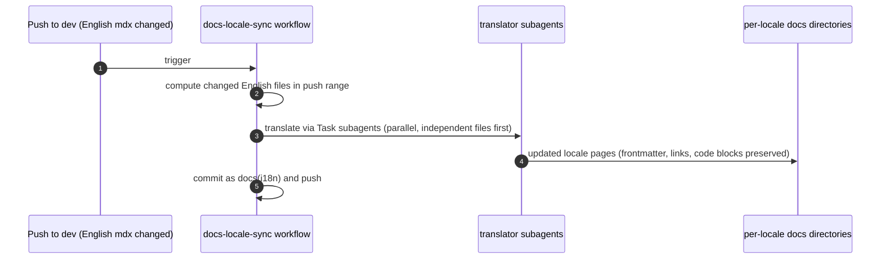
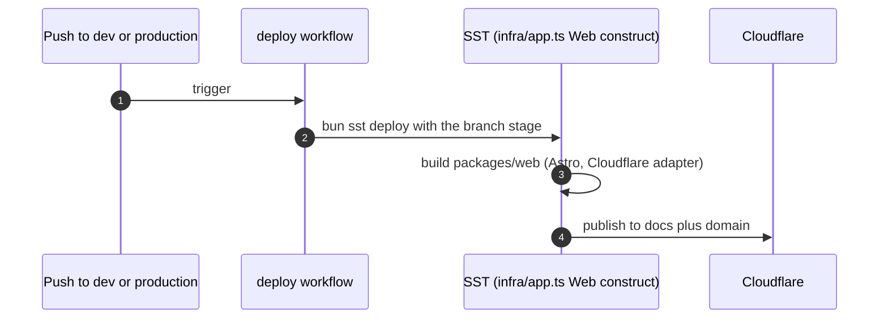

# Specification: Docs website

## Overview

The docs website is an Astro 5 Starlight 0.34 application in `packages/web` that renders MDX content collections to a server-output site served through the Cloudflare adapter.
Content updates flow through two agent pipelines (scheduled English updates and push-triggered locale sync), and releases flow through `sst deploy` via the `Web` Astro construct in `infra/app.ts`.

## Architecture

```
packages/web/src/content/docs/*.mdx (English sources)
per-locale MDX trees under packages/web/src/content/docs (17 locale trees)
packages/web/src/content/i18n/*.json (UI strings)
        │
        ▼
astro.config.mjs (Starlight sidebar, locales, custom components, toolbeam theme)
        │
        ▼
Astro build (server output, Cloudflare adapter, configSchema hook → dist/config.json, tui.json)
        │
        ▼
SST sst.cloudflare.x.Astro "Web" (infra/app.ts, path packages/web, docs subdomain)
        │
        ▼
Cloudflare edge (deploy.yml runs bun sst deploy on dev and production)
```

## Data Models

### Doc page (MDX content collection)

| Field | Type | Constraints | Description |
|---|---|---|---|
| path | text | PK | File path under `src/content/docs` (locale implied by directory) |
| frontmatter.title | text | not null | Page title shown in navigation and head |
| frontmatter.description | text | nullable | Short summary used for SEO and link previews |
| body | mdx | not null | Markdown with embedded Starlight and Solid components |

### Locale tree

| Field | Type | Constraints | Description |
|---|---|---|---|
| locale | text | PK | Locale slug matching `astro.config.mjs` (e.g. `de`, `pt-br`, `zh-cn`) |
| dir | text | not null | Text direction (`ltr`, or `rtl` for `ar`) |
| pages | list | not null | Translated MDX files mirroring the English page set |

### UI strings (i18n JSON)

| Field | Type | Constraints | Description |
|---|---|---|---|
| locale | text | PK | Locale slug matching a file in `src/content/i18n` |
| keys | json | not null | Translated interface strings (e.g. header links) consumed by custom components |

## API Contracts

The docs site exposes no custom HTTP API.
Its external contracts are the rendered site surface plus build artifacts:

- `GET /docs/*` serves the Starlight pages behind the site base path.
- `dist/config.json` and `dist/tui.json` are emitted at build end by the `configSchema` hook (via `../opencode/script/schema.ts`).
- Edit links resolve to `${github}/edit/dev/packages/web/`.

## Sequences

### Agent docs-update pipeline



### Locale sync pipeline (currently disabled)



### Build and deploy



## Technical Decisions

| Decision | Choice | Rationale |
|---|---|---|
| Site framework | Astro 5 with Starlight 0.34 | Docs-oriented theme with sidebar, search, i18n, and edit links built in |
| Hosting | Cloudflare via SST `sst.cloudflare.x.Astro` | Same edge platform and deploy pipeline as the rest of the app |
| Rendering | Server output with `imageService: passthrough` | Matches SST deploy expectations and avoids remote image processing |
| Interactivity | SolidJS islands (`@astrojs/solid-js`) | Shares the repo Solid component model for interactive docs widgets |
| Theme | `toolbeam-docs-theme` Starlight plugin plus custom components | Shared header and footer chrome across marketing and docs surfaces |
| Content format | MDX content collections with per-locale directories | Colocated, reviewable translations with structure aligned to English |
| Sidebar | Explicit registration in `astro.config.mjs` | Full control over section order (Usage, Configure, Develop) at the cost of manual registration |
| Config schemas | `configSchema` integration hook emitting `config.json` and `tui.json` | Keeps published schemas in sync with every docs build |
| Update automation | Scheduled `docs` agent over recent commits | Keeps docs current without manual triage of every change |
| Translation | Translator subagents, English sources untouched | Parallel, reviewable locale updates that cannot regress English pages |

## Risks and Unknowns

1. The `docs` agent has no definition under `.opencode/agent/`, so the update pipeline depends on an agent that cannot be reviewed in this repo.
2. Locale sync is disabled (`if: false`), so translations can silently drift behind English sources.
3. Sidebar registration is manual, so a new page renders unlisted if the agent or author skips the `astro.config.mjs` step.
4. No link checking, visual tests, or Astro build checks run in CI outside of `sst deploy`.

## Out of Scope

- The legacy Mintlify starter in `packages/docs` (unreferenced by any workflow).
- Content versioning (the Starlight config tracks a single current version).
- Share-app interactive pages under `packages/web/src` beyond their role as docs-adjacent components.
