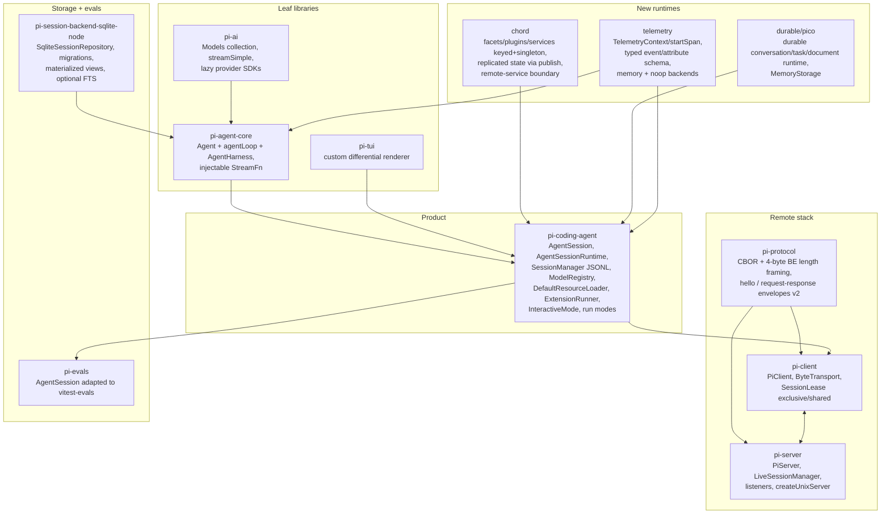
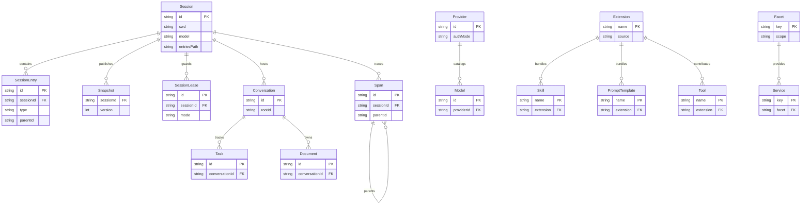

# Architecture

## System Overview

Pi is a layered TypeScript monorepo.
Three leaf libraries (`pi-ai`, `pi-agent-core`, `pi-tui`) compose into the `pi-coding-agent` CLI product.
`pi-ai` is the LLM boundary, `pi-agent-core` is the agent loop boundary, `pi-tui` is the rendering boundary, and the coding agent wires them together with sessions, extensions, tools, and a TUI.
A second stack enables remote sessions: `pi-protocol` defines the wire protocol and framing, `pi-client` is the transport-neutral client used by the coding agent to attach to remote servers, and `pi-server` hosts `PiServer` session servers.
`pi-session-backend-sqlite-node` provides an optional SQLite backend for agent sessions, and `pi-evals` adapts a real `AgentSession` to `vitest-evals` for model-backed behavioral checks.
Three newer runtimes cut across the product: `chord` (facets/plugins/services with replicated state), `durable/pico` (durable conversation/task/document runtime), and `telemetry` (spans and typed events).
The legacy child-process supervisor in `pi-server` is gone.

## Entity Relationship Diagram

There is no traditional domain database.
Session state lives in JSONL files (`SessionManager`), SQLite is an optional session repository backend, and pico conversations/tasks/documents live in the durable runtime store.
The full detailed database schema (types, constraints, indexes) lives in `schema.dbml` when the project uses a database.

## Key Components

| Component | Responsibility | Technology |
|---|---|---|
| `pi-ai` | Unified multi-provider LLM chat + image API, auth resolution, token/cost tracking, streaming, tool-calling | TypeScript, TypeBox, lazy-loaded provider SDKs |
| `pi-agent-core` (Agent) | Stateful agent runtime: prompt loop, tool execution (sequential/parallel), retry/abort, message queues | TypeScript, built on pi-ai via injectable `StreamFn` |
| `pi-agent-core` (AgentHarness) | Higher-level orchestrator: sessions, compaction, skills, system prompts, provider hooks | TypeScript |
| `pi-tui` | Terminal UI framework: components, overlays, differential rendering, input, terminal images | TypeScript (custom, no React/Ink), native addons for win32/darwin |
| `AgentSession` | Coding-agent core: lifecycle, prompt loop, model/thinking management, compaction, branching, bash exec, HTML export | TypeScript |
| `AgentSessionRuntime` | Owns the active session + cwd-bound services; hot-swaps on fork/switch/tree navigation | TypeScript |
| `SessionManager` | JSONL session persistence, tree-structured entries, branching, listing, migration | TypeScript, JSONL |
| `ModelRegistry` | Model/provider catalog: built-ins, user `models.json`, extension providers, API key + header resolution | TypeScript |
| `DefaultResourceLoader` | Discovers/loads extensions, skills, prompt templates, themes, AGENTS.md/CLAUDE.md context | TypeScript, jiti |
| `ExtensionRunner` | Extension lifecycle, event dispatch, UI context | TypeScript |
| Built-in tools | `read`, `bash`, `edit`, `write` (default) and `grep`, `find`, `ls` (read-only set) | TypeScript |
| `InteractiveMode` | Full TUI: editor, message list, footer/header, slash-command UIs, widgets, overlays | pi-tui |
| Run modes | Interactive (default), print (`-p`), JSON (`--mode json`), RPC (`--mode rpc`), SDK | TypeScript |
| `pi-protocol` | Runtime-neutral schemas, types, CBOR encoding, and byte-stream framing for the pi protocol (length-prefixed framed messages, `hello`/request-response envelopes, v2) | TypeScript, typebox |
| `PiClient` (pi-client) | Transport-neutral remote session client: `ByteTransport` interface, `SessionLease` ownership (exclusive/shared), `acquireSession`/`attachSession`/`createSession`, snapshot subscription | TypeScript, built on pi-protocol |
| `PiServer` (pi-server) | Token-authenticated session server: listeners, `LiveSessionManager`, session/snapshot publication, `createUnixServer` preset, `testing` harness | TypeScript, built on pi-protocol |
| Server `legacy`/supervisor (pi-server) | Removed: the former child-process supervisor (`server` CLI), Unix socket IPC, Radius presence, and RPC stream bridge are gone | N/A (deleted) |
| `pi-session-backend-sqlite-node` | `node:sqlite` adapter (`SqliteDatabase`), SQLite session repository, migrations, materialized views, optional FTS search for pi-agent-core sessions | TypeScript, node:sqlite |
| `pi-evals` | Behavioral model-backed evals: adapts a real `AgentSession` to `vitest-evals`, isolated temp project/agent dirs, native pi session artifacts | TypeScript, vitest-evals |
| `chord` | Facet/plugin/service runtime: keyed and singleton registrations, replicated state via publish, remote-service boundary, standalone use outside the coding agent | TypeScript |
| `durable`/`pico` | Durable conversation/task/document runtime: `MemoryStorage`, `ROOT_CONVERSATION_ID`, versioned `docs/pico-v5*` design notes | TypeScript |
| `telemetry` | Structured observability primitives: `TelemetryContext`/`startSpan`, `TelemetrySpan`, typed event/attribute schema utilities, memory + noop backends | TypeScript |

## Data Flow

A user prompt flows through the system as follows.
Input arrives via the editor (interactive), `-p`/stdin (print/JSON), JSONL (RPC), or `session.prompt()` (SDK).
`AgentSession.prompt()` expands slash commands, skills, and prompt templates, then emits an `input` event extensions can intercept or transform.
If the agent is mid-stream, the message is queued as steering (delivered after the current tool batch) or follow-up (after the agent stops), based on streaming behavior settings.
`before_agent_start` fires (extensions may modify the system prompt or inject messages).
`AgentSession` delegates to the pi-agent-core `Agent`, whose `agentLoop` calls the injectable `StreamFn`.
`StreamFn` (default `streamSimple` from pi-ai) resolves auth via `ModelRegistry`, applies retry/timeout/transport settings and provider attribution headers, then streams events from the provider SDK.
The agent streams text/thinking/toolcall deltas; tool calls are validated and executed (sequential or parallel), emitting `tool_call`/`tool_result` events extensions can observe or mutate.
After the agent stops, `AgentSession` loops: handles retryable errors, compaction triggers, and queued steering/follow-up messages via `agent.continue()` until queues drain.
Throughout, `AgentSession` appends entries (messages, model changes, compaction summaries, branch summaries) to the `SessionManager` JSONL file.
Telemetry spans and typed events wrap the loop (memory backend in tests, noop by default).
Durable pico conversations/tasks/documents persist alongside the session when the durable runtime is attached.
Each mode renders the streamed events: `InteractiveMode` renders incrementally via pi-tui; print writes final text or one JSON object per event; RPC forwards `AgentSessionEvent`s as JSONL on stdout.
In remote-session mode, the coding agent attaches a `PiClient` to a `PiServer` over a `ByteTransport` (e.g. Unix socket): the client authenticates via `hello` token, acquires exclusive/shared `SessionLease`s, sends framed CBOR request/response envelopes, and renders authoritative server/session snapshots (progress events are transient and never mutated optimistically).

## Infrastructure

Hosting is local-first: the CLI runs on the developer machine, remote sessions run over Unix sockets or pluggable byte transports, and persistence is JSONL files with SQLite as an optional session backend.
CI, release, and tooling details live in `infrastructure.md`.
Monitoring, telemetry backends, and alerting live in `observability.md`.

## Architecture Decisions

- **Minimal core, maximal extension surface:** No built-in MCP, sub-agents, plan mode, or permission popups. Extensions provide these. (Maintainer philosophy in `CONTRIBUTING.md`.)
- **Provider-centric LLM access (pi-ai):** The `Models` collection routes by owning provider; legacy global registry preserved in `/compat` for migration.
- **Lazy SDK loading:** Provider factories import only catalogs; provider SDKs load on first request via `.lazy.ts` wrappers.
- **Transport-agnostic agent:** `pi-agent-core` calls an injectable `StreamFn`, enabling direct (`streamSimple`), proxy (`streamProxy`), or custom backends.
- **Custom TUI:** `pi-tui` is hand-written (imperative component model + differential renderer), not React/Ink.
- **Failures encoded, not thrown:** LLM stream failures are encoded as final events with `stopReason: "error"|"aborted"`; agent run failures become synthetic failure assistant messages.
- **Transport-neutral remote sessions:** `pi-client` never imports Node-specific code; all byte movement goes through a small `ByteTransport` interface, so WebSocket, Unix socket, or custom transports all work. `pi-protocol` decoders accept arbitrary fragmentation/coalescing for the same reason.
- **Authoritative snapshots:** in the pi protocol, server and session snapshots are authoritative; progress events are transient UI hints and are never reduced into authoritative state.
- **Session lease ownership:** exclusive/shared `SessionLease`s gate who may mutate or observe a remote session (exclusive acquisition fails while any lease exists).
- **Lockstep versioning:** All packages share one version; `patch` = fixes + additions, `minor` = breaking changes, no major releases.
- **Local-first persistence:** JSONL is the session source of truth; SQLite is an interchangeable repository backend, not a second source of truth.
- **Standalone chord runtime:** chord facets/plugins/services work without the coding agent and cross process boundaries only through the remote-service boundary with replicated state via publish.
- **Durable pico over ephemeral chat:** long-lived conversation/task/document state lives in the durable runtime (`MemoryStorage` today), separate from the append-only session log.

Formal ADRs live under `.sdlc/knowledge/decisions/`.
