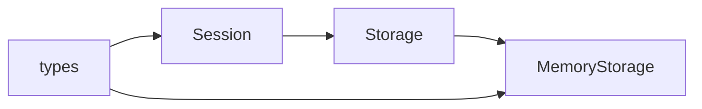
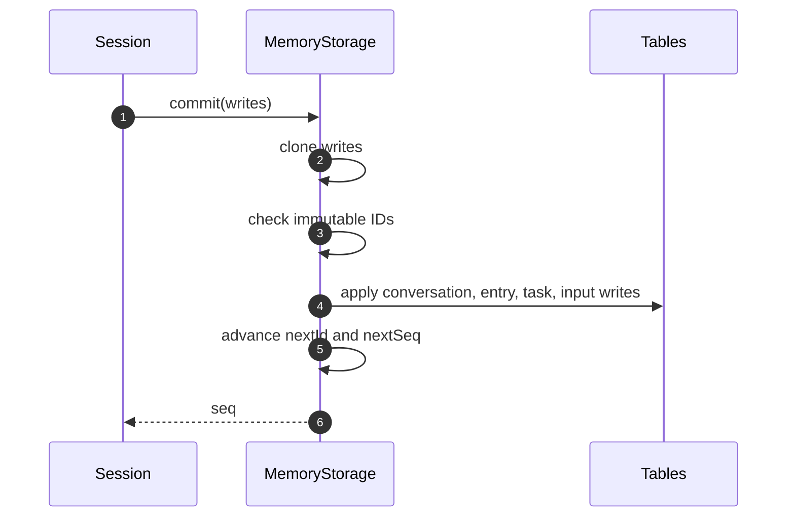
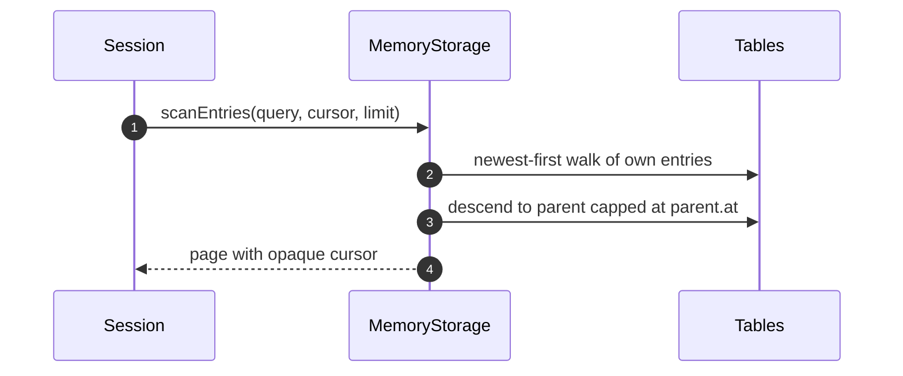

# Specification: Durable runtime

## Overview

The package implements the Pico durable-record layer as pure TypeScript contracts plus one detached in-memory store.
Record types encode every lifecycle discriminator as a union so invalid states fail at compile time.
`MemoryStorage` keeps sorted per-table indexes and clones across the ownership boundary so it behaves like a serialization-backed store.

## Architecture

`types.ts` owns all record contracts and the `Storage` interface.
`memory-storage.ts` implements `Storage` with `Map` tables and sorted ID arrays.
`index.ts` re-exports the public surface (`MemoryStorage`, `ROOT_CONVERSATION_ID`, and the record types).
The Session (not yet in this package) serializes commits and supplies semantic validity.

## Data Models

### Conversation record

| Field | Type | Constraints | Description |
|---|---|---|---|
| id | Id | PK, not null, globally unique | Transcript scope identity. |
| parent.conversationId | Id | FK when present | Fork source conversation. |
| parent.at | Id | Inclusive cap when present | Newest inherited parent entry. |
| owner.conversationId | Id | FK when present | Creator conversation for abort and idle waits. |
| owner.taskId | Id | FK when present | Creator task for abort and idle waits. |

### Entry record

| Field | Type | Constraints | Description |
|---|---|---|---|
| id | Id | PK, immutable, never reused | Global transcript event identity. |
| conversationId | Id | FK, not null | Owning conversation. |
| kind | string | Not null | Application-defined entry discriminator. |
| model | readonly Message[] | Optional | Messages contributed to model context. |
| data | JsonValue | Optional | Payload for views, plugins, or bookkeeping. |
| head | Id | Optional | First entry of the active context selected by this entry. |
| edits | readonly ContextEdit[] | Optional | Context-only overrides of earlier visible entries. |
| byTaskId | Id | Optional | Task that appended this entry. |

### Task record

| Field | Type | Constraints | Description |
|---|---|---|---|
| id | Id | PK, globally unique | Task identity. |
| conversationId | Id | FK, not null | Attaching conversation. |
| kind | string | Not null | Registered task definition name. |
| version | number | Not null | Definition version for input and checkpoint migration. |
| input | I | Retained while live or terminal | Original task input. |
| after | readonly Id[] | Possibly empty | Tasks that must be terminal before ordinary execution. |
| background | boolean | Not null | Exclusion from idle waits and conversation aborts. |
| abortRequested | boolean | Not null | Durable abort mark checked before run-mode progress commits. |
| state | TaskState | Pending, running, or terminal | Complete durable execution state. |
| memos | Record<string, JsonValue> | Live tasks only | Small first-writer-wins values. |
| outcome | TaskOutcome | Terminal tasks only | Completed, failed, aborted, orphaned, or faulted receipt. |

### Document record

| Field | Type | Constraints | Description |
|---|---|---|---|
| id | Id | PK, never reused across incarnations | Unique incarnation identity. |
| kind | string | Not null | Registered document kind. |
| key | string | Optional | Family member key, absent for singletons. |
| createdAt | Seq | Stamped by storage | Creating commit sequence. |
| retiredAt | Seq | Absent while current | Retiring commit sequence. |
| scope | session, conversation, or task | Not null | Ownership scope with conversation ID or task ID where applicable. |
| history | latest or rewindable | Conversation scope only | Retention policy for as-of reads. |
| fork | current, initial, or asOf | Conversation scope only | Initialization policy, constrained by history choice. |

### Input record

| Field | Type | Constraints | Description |
|---|---|---|---|
| id | Id | PK, globally unique | Admitted input identity. |
| conversationId | Id | FK, not null | Owning conversation. |
| requestId | string | Optional, conversation-scoped | Host deduplication key. |
| status | queued, placed, done, or unanswered | Not null | Lifecycle state. |
| entry | Id | Placed and done, optional for unanswered | Transcript entry created at placement. |
| answer | Id | Done only | Assistant answer entry. |
| reason | string | Unanswered only | Machine-readable terminal explanation. |
| detail | JsonValue | Optional | Structured diagnostics for unanswered inputs and stored errors. |

## API Contracts

The package exposes a TypeScript interface, not an HTTP surface, so there is no `api.yaml`.
The `Storage` boundary is: `commit`, `mintId`, `conversation`, `scanConversations`, `entry`, `findLatestHeadMarker`, `scanEntries`, `task`, `scanTasks`, `input`, `inputByRequest`, and `close`.
Cursor pagination returns `{ items, next }` where `next` is an opaque `{ after }` continuation.
`findLatestHeadMarker` walks the conversation ancestry so forks resolve markers through each parent cap.

## Sequences

### Atomic mixed-table commit

### Fork-aware entry scan

## Technical Decisions

| Decision | Choice | Rationale |
|---|---|---|
| ID space | One global `number` namespace starting at 2 with 1 reserved | A single namespace lets one commit span tables without cross-table collisions. |
| Detachment | Deep clone on write and on read | Cloning matches serialization-backed ownership so conformance transfers to real backends. |
| Immutability enforcement | Reject duplicate conversation and entry IDs, reject cross-table ID reuse | The store guarantees IDs are never reused after a committed write. |
| Fork history | Ancestry walk capped at each `parent.at` | Caps give deterministic newest-first visibility without copying parent entries. |
| Document scope split | Session, conversation-scoped, and task-scoped variants in one union | The union keeps history and fork policies exactly where they apply. |

## Risks and Unknowns

1. A future persistent backend may interpret cursor shape or commit ordering differently than `MemoryStorage`.
2. Prototype-safe cloning adds per-record cost that needs measuring once real workloads exist.
3. Document deltas and sources currently live outside this package, so the full Pico commit path is not yet exercisable here.

## Out of Scope

- The Session mutation line and task scheduler.
- Persistent storage backends such as SQLite.
- Chord document delta mechanics, covered by the Chord package and `pico-v5-chord-usage.md`.
- HTTP endpoints and OpenAPI contracts.
