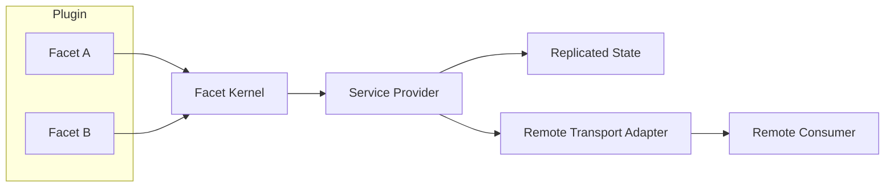
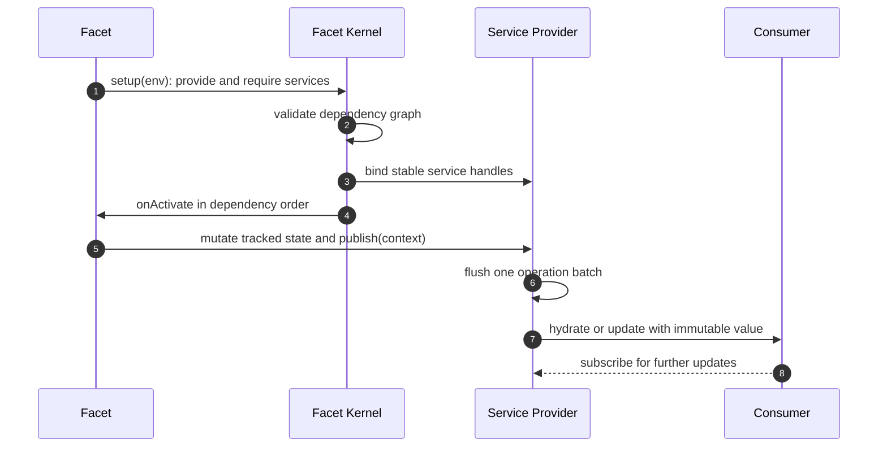

# Specification: Chord Composition Runtime

## Overview

The runtime models each plugin as synchronous facet setup functions over a typed service graph, resolves that graph in a facet kernel, and replicates tracked JSON state to local and remote subscribers through a transport-independent wire grammar.

## Architecture

## Data Models

### Facet

| Field | Type | Constraints | Description |
|---|---|---|---|
| id | string | PK, not null | Stable identity of one facet within its plugin |
| setup | function | synchronous, not null | Declares provided and required services against the facet environment |

### Service

| Field | Type | Constraints | Description |
|---|---|---|---|
| id | string | PK, not null, `$chord.*` reserved | Stable identity of one shared TypeScript service contract |
| local | boolean | not null, defaults false | Marks process-local contracts that are never published remotely |
| mode | singleton or keyed | not null | Selects one provider versus dynamic per-key instances |

### Replicated State

| Field | Type | Constraints | Description |
|---|---|---|---|
| state | tracked proxy | producer-only writes | Mutable view that records operations for the next publication |
| value | immutable snapshot or undefined | consumer-visible | Latest hydrated value, never mutated by later updates |
| sequence | number | monotonically increasing | Orders hydrate and update deliveries per subscription |

### Service Subscription Snapshot

| Field | Type | Constraints | Description |
|---|---|---|---|
| serviceId | string | not null | Service the snapshot describes |
| mode | singleton or keyed | not null | Provider mode the snapshot was taken under |
| instances | array | possibly empty | Per-instance member lists with state sequences and operation batches |

## API Contracts

There is no HTTP surface in this feature, so no api.yaml exists.
The normative contract is the TypeScript surface exported from the package root plus the context, delta, bundler, and node entry points.

## Sequences

### Plugin bind, activate, publish, replicate

## Technical Decisions

| Decision | Choice | Rationale |
|---|---|---|
| Package coupling | Standalone with zero Pi workspace dependencies | Lets unrelated applications adopt Chord without the Pi monorepo |
| Remote boundary | Transport-independent wire grammar with application-supplied adapters | Keeps Chord neutral on framing, routing, and envelopes while enforcing strict JSON |
| State replication | Proxy-tracked mutations with per-stream path codecs | Preserves string and array operations compactly while isolating client streams |
| Module loading | esbuild bundles verified by SHA-256 and compiled with node VM | Gives content-addressed reloadable generations without Node module-cache coupling |
| Context model | Explicit Go-like context parameter on operations | Carries cancellation and scoped values without Chord depending on either domain |

## Risks and Unknowns

1. Symmetric RPC peers are planned but not yet specified as the reference transport implementation.
2. Delta batches guarantee convergence without a canonical or minimal form, which may surprise bandwidth-sensitive adapters.
3. The `$chord.*` service-ID reservation is enforced in code but its long-term namespace policy is undecided.

## Out of Scope

- Any concrete transport, framing, routing, or envelope implementation.
- A canonical or minimal delta-batch encoding.
- Pi-specific hosts, TUIs, or agent workers built on top of Chord.
