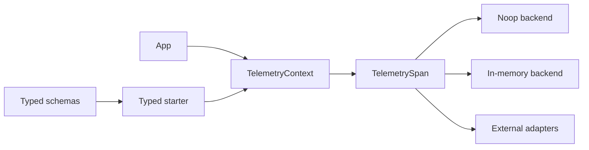
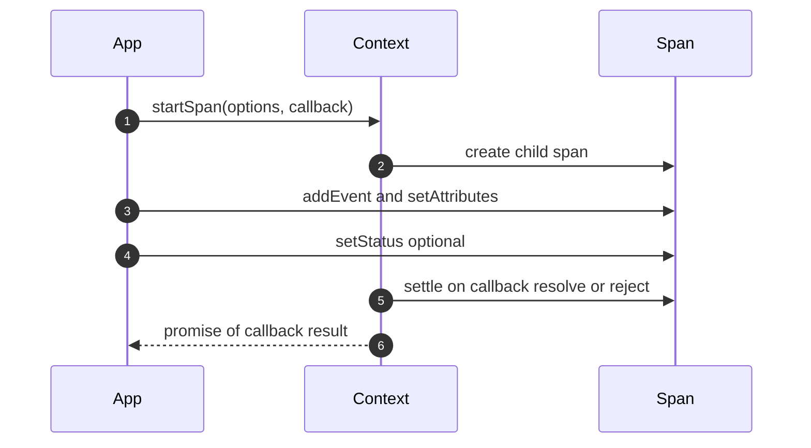

# Specification: Telemetry Contracts

## Overview

The package implements explicit callback-managed telemetry with generic adapter semantics.
Schemas act as compile-time vocabularies while adapters translate generic calls to backend concepts at runtime.
Reference backends cover disabled telemetry and process-local capture without exporters.

## Architecture

Adapter implementations bridge one generic surface to many backends while pi code always passes parents explicitly.
The typed starter binds a parent context to schema vocabularies without retaining schemas at runtime.

## Data Models

### SpanOptions

| Field | Type | Constraints | Description |
|---|---|---|---|
| name | string | required | Open span name |
| attributes | SpanAttributes | optional | Open start attribute bag |

### SpanAttributes and AttributeValue

AttributeValue supports string and number and boolean scalars plus readonly arrays of each scalar.
SpanAttributes maps names to values where undefined entries are ignored.
Merging copies values so later reads cannot mutate recorded state through aliases.

### SpanStatus

| Variant | Fields | Description |
|---|---|---|
| ok | none | Normal completion marker |
| error | optional name and message | Failure marker with optional error details |

Automatic settlement uses ok for normal returns and error for throws or rejections.
Explicit setStatus calls override automatic settlement with last-write-wins semantics.

### RecordedTelemetrySpan

| Field | Type | Description |
|---|---|---|
| id | number | Deterministic span identifier |
| parentId | number or null | Parent identifier with null for roots |
| name | string | Recorded span name |
| attributes | SpanAttributes | Merged attribute bag |
| events | array of RecordedTelemetryEvent | Ordered event list |
| status | SpanStatus | Final outcome |
| settled | boolean | Settlement marker |
| endSequence | number or undefined | Deterministic end ordering assigned at settlement |

Snapshots are detached copies returned in span-start order without timestamps.

### RecordedTelemetryEvent

| Field | Type | Description |
|---|---|---|
| name | string | Event name |
| attributes | SpanAttributes | Event attribute bag |

### TelemetrySchemaDefinition

| Field | Type | Description |
|---|---|---|
| version | number | Schema version marker |
| spans | record of TelemetrySpanDefinition | Declared span vocabulary |

Schemas are ordinary JSON-serializable data with no runtime validation behavior.

### TelemetrySpanDefinition

| Field | Type | Description |
|---|---|---|
| description | string | Span purpose |
| parents | TelemetryParentDefinition | Descriptive parent rule |
| startAttributes | record of definitions | Attributes normally known at span creation |
| endAttributes | record of definitions | Optional completion enrichment recorded later |
| events | optional record of TelemetryEventDefinition | Declared event vocabulary |
| status | default plus errorWhen | Documented outcome rule |

Start and end attributes share one backend attribute bag despite their separate declaration timing.

### TelemetryAttributeDefinition

Supported types are string and number and boolean plus string arrays and number arrays and boolean arrays.
Scalar definitions accept closed value sets while array definitions accept closed element value sets.
Metadata covers description and examples and sensitivity and cardinality markers.
Start and event attribute definitions add a required flag while end attributes stay optional.

### TelemetryEventDefinition

| Field | Type | Description |
|---|---|---|
| description | string | Event purpose |
| attributes | record of definitions | Declared event attribute vocabulary |

### TelemetryParentDefinition

| Kind | Meaning |
|---|---|
| any | Root span or any caller span |
| root_or_external | Root span or caller-owned span outside the schema |
| spans | Only the listed schema spans |

Parent metadata is descriptive and is not enforced at runtime.

## API Contracts

No HTTP API exists because the package exposes TypeScript interfaces only.
Normative types live beside the reference backends in the telemetry source tree.

| Export | Purpose |
|---|---|
| TelemetryContext | Starts callback-managed child spans |
| TelemetrySpan | Records attributes and events and status while acting as a child context |
| NOOP_TELEMETRY_CONTEXT | Shared passive context for disabled telemetry |
| InMemoryTelemetryContext | Reference adapter with process-local recording |
| defineTelemetrySchema | Typed identity helper for serializable schema data |
| createTypedSpanStarter | Binds a parent context to one or more schema vocabularies |

## Sequences

### Callback span lifecycle

The startSpan call creates a child span and invokes the callback synchronously exactly once.
The call keeps the span open until a returned promise settles.
Recording calls merge into the span while the callback is active.
Settlement applies automatic status only when no explicit status was recorded.
Calls made after settlement are inert and never throw.

### Typed nested spans

The typed starter resolves a span name to its owning schema at compile time.
Its callback receives a schema-scoped span plus a child starter bound to the callback span.
Nested starter calls therefore record correct parentage without ambient state.

## Technical Decisions

| Decision | Choice | Rationale |
|---|---|---|
| Propagation model | Explicit parent contexts | Explicit propagation avoids ambient state and stays portable across runtimes. |
| Contract shape | Vendor-neutral callback API | A neutral API lets adapters target tracing or logging backends without changing call sites. |
| Schema role | Schema-first compile-time vocabularies | Compile-time checks keep emitted names consistent without runtime validation costs. |
| Settlement ownership | startSpan owns settlement | Single ownership keeps spans open across async work and makes post-settlement calls inert. |
| Failure handling | Passive non-throwing recording | Passive recording keeps diagnostics from changing business outcomes. |

## Risks and Unknowns

1. Unbounded in-memory storage can grow without limit in long-lived recording scopes.
2. Sensitive attributes rely on schema authors and data policies rather than runtime redaction.
3. Backend translation quality depends on adapter authors applying the conformance suite correctly.

## Out of Scope

- Exporters and sampling and flushing remain adapter responsibilities.
- No OpenAPI contract exists because the surface is a TypeScript module rather than an HTTP service.
- Durable persistence of contexts or spans is excluded from this package.
