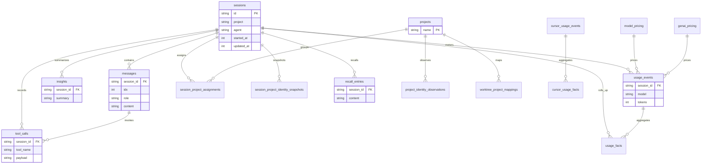

# Architecture

## System overview

```
+-------------------+      +---------------------+      +-------------------+
| Agent Session     | ---> | Sync Engine         | ---> | SQLite Database   |
| Files (disk)      |      | (discovery, parse,  |      | (primary archive) |
| + Raw Custody     |      |  sanitize, write)   |      | + FTS5 indexes    |
| Manifests (push)  |      |                     |      | + RRF hybrid rank |
+-------------------+      +---------------------+      +--------+----------+
                                                                |
                                                                v
+-------------------+      +---------------------+      +-------------------+
| Svelte 5 SPA      | <--- | HTTP Server (Huma)  | <--- | Service Layer     |
| (embedded binary) |      | REST API + SSE      |      | (Direct + HTTP    |
|                   |      | + bearer auth       |      |  backends)        |
+-------------------+      +---------------------+      +--------+----------+
                                                                |
                                    +---------------------------+---------------------------+------------------+
                                    |                           |                           |                  |
                                    v                           v                           v                  v
                            +------------------+      +------------------+      +------------------+   +------------------+
                            | PostgreSQL Store |      | DuckDB Store     |      | ClickHouse Store |   | Vector DB        |
                            | (read-only push) |      | (read-only push, |      | (read-only push, |   | (semantic index, |
                            |                  |      |  Quack protocol) |      |  remote mirror)  |   |  embeddings)     |
                            +------------------+      +------------------+      +------------------+   +------------------+
```

## Key components

| Component | Responsibility | Technology |
|---|---|---|
| CLI (cmd/agentsview) | Entry point, cobra commands, daemon lifecycle | Go, cobra, pflag |
| Sync Engine (internal/sync) | Session file discovery, parsing, sanitization, DB writes | Go, fsnotify |
| Session Watcher (internal/sessionwatch) | Polls one session DB state and source file for live refresh | Go, polling |
| Background Poller (internal/poller) | Runs interval-driven background jobs | Go |
| Parsers (internal/parser) | Per-agent session file format parsers (50+ agents) | Go |
| SQLite DB (internal/db) | Primary archive: sessions, messages, FTS5, analytics, usage | SQLite, FTS5 |
| Hybrid Search (internal/db RRFMerge) | Fuses FTS5 and vector legs with reciprocal-rank fusion | Go |
| HTTP Server (internal/server) | REST API (Huma), SPA serving, SSE events, bearer auth, CORS | Go, Huma v2 |
| Service Layer (internal/service, internal/servicehttp) | Session service interface with DirectBackend and HTTPBackend | Go |
| Frontend (frontend/) | SPA with session browser, analytics, usage, search UI | Svelte 5, TypeScript, Vite |
| PostgreSQL (internal/postgres) | Push sync from SQLite, read-only serve | Go, pgx |
| DuckDB (internal/duckdb) | Push sync from SQLite, read-only serve, Quack protocol | Go, duckdb driver |
| ClickHouse (internal/clickhouse) | Push sync from SQLite, remote read-only mirror and serve | Go, ClickHouse driver |
| Vector (internal/vector) | Semantic search index, embeddings encoder and manager | Go, sqlite-vec |
| Raw Ingest (internal/rawcapture, internal/rawcheckpoint, internal/rawsync, internal/rawupload, internal/rawclient, internal/rawderive, internal/rawwatch, internal/rawpath) | Authenticated raw custody transport from laptop outbox to derived sessions | Go, device tokens |
| Remote Sync (internal/remotesync) | Archive mirror and delta import over SSH and HTTP | Go, SSH, HTTP |
| MCP Server (internal/mcp) | Exposes archive tools over stdio and HTTP transports | Go, MCP |
| Activity (internal/activity) | Activity aggregation engine and report artifacts | Go |
| Insight (internal/insight) | AI-generated canned and generated session insights | Go |
| Signals (internal/signals) | Session health, outcome, and context heuristics | Go |
| Recall (internal/recall) | Recall entry extraction, ranking, and query context | Go |
| Artifacts (internal/artifact) | Canonical artifact export, import, store, and folder transport | Go |
| Config (internal/config) | TOML-based config, env vars, CLI flags | Go, BurntSushi/toml |
| Telemetry (internal/telemetry) | Anonymous PostHog reporter with env opt-out | Go, PostHog |

## Data flow

1. Agent sessions are written to disk by AI coding agents (Claude, Codex, Cursor, etc.).
2. The Sync Engine discovers new or changed session files via file watcher, session watcher, poller, or periodic scan.
3. Each file is dispatched to the appropriate parser based on agent type.
4. Parsed sessions are sanitized and written to SQLite in batches.
5. Raw custody manifests follow a parallel path from laptop outbox through authenticated upload into derived sessions.
6. The Service Layer exposes sessions through DirectBackend locally or HTTPBackend against a running daemon.
7. The HTTP server serves the REST API from the service layer with bearer auth.
8. The Svelte SPA queries the API and renders session views.
9. PostgreSQL, DuckDB, and ClickHouse mirrors are populated on-demand via push commands and serve read-only traffic.
10. The Vector index is built on-demand and fused with FTS5 through RRF hybrid search in the database layer.
11. SSE streams on `/api/v1/events` push live updates to connected clients.
12. Remote sync mirrors archives across machines over SSH or HTTP with delta import.
13. The MCP server exposes archive search and recall tools to external agents.

## Infrastructure

| Aspect | Detail |
|---|---|
| CI/CD | GitHub Actions (see .github/workflows/) |
| Build | Makefile-based; CGO_ENABLED=1 + fts5 build tag |
| Desktop | Tauri wrapper for macOS (DMG) and Windows |
| Container | Docker image published to ghcr.io |
| Package | Homebrew cask for desktop app |
| Telemetry | Anonymous PostHog ping (opt-out), disabled in test binaries |
| Release | GitHub Releases with GoReleaser or similar |
| Linting | golangci-lint with NilAway |

## Entity relationship diagram


