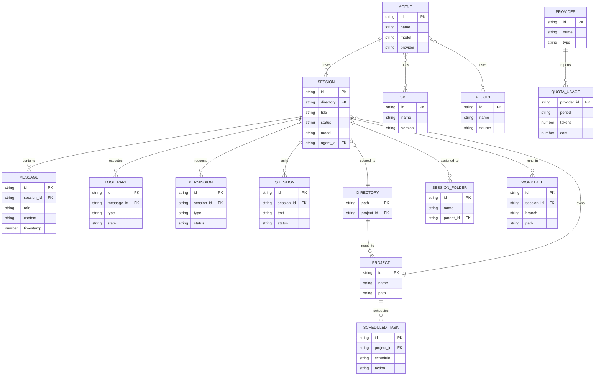

# Architecture

## System Overview

```mermaid
flowchart TD
    VSC[VS Code Ext<br/>webview + host] --> UI[@openchamber/ui<br/>shared React]
    UI --> ELE[Electron App<br/>main.mjs boots server in-proc]
    UI --> WEB[Web / PWA<br/>Vite SPA via Express]
    UI --> VSE[VS Code Ext<br/>webview loads shared UI]
    ELE --> SVR[Express Server<br/>packages/web/server/index.js]
    WEB --> SVR
    VSE --> SVR
    SVR --> SDK[OpenCode SDK<br/>SSE + HTTP]
    SVR --> FSG[FS / Git]
    SVR --> TRM[Terminal<br/>WS + PTY]
    SDK --> OCC[OpenCode CLI<br/>external]
```

## Entity Relationship Diagram



These entities are derived from the codebase's domain abstractions (sessions, messages, agents, projects, config entities), not a relational database.
OpenChamber uses no persistent database; all state is stored in files (JSON, markdown, OpenCode's own state under `~/.local/share/opencode/`) or held in memory.
The `schema.dbml` companion is therefore not applicable.

## Key Components

| Component | Responsibility | Technology |
|---|---|---|
| `packages/ui` | Shared React components, hooks, stores, theme, and sync layer | React 19, TypeScript, Zustand, Tailwind v4, Base UI, CodeMirror |
| `packages/web` | Express server, API routes, CLI, Vite frontend build | Express 5, Node.js >=22, Bun, Vite 7 |
| `packages/web/server` | Backend runtime: OpenCode lifecycle, SSE event pipeline, Git, terminal, tunnels, relay, auth, TTS, dictation, notifications, quota, session goals, session assist, small model | Express, ws, simple-git, bun-pty/node-pty, Cloudflare tunnel, ngrok, sherpa-onnx |
| `packages/electron` | Forward desktop shell; boots web server in-process, native integrations | Electron 41, electron-builder |
| `packages/mobile` | Capacitor mobile app wrapping the mobile web UI for iOS and Android | Capacitor, iOS (Swift), Android (Java/Kotlin) |
| `packages/vscode` | VS Code extension with sidebar webview | VS Code Extension API, esbuild |
| `packages/docs` | Documentation website source | MDX |
| `packages/electron/ssh-manager.mjs` | SSH connection management for remote OpenChamber instances (Electron only) | Node SSH2, Electron IPC |
| `packages/web/server/lib/preview/` | Preview browser proxy for locally running dev web apps | http-proxy-middleware |
| `packages/web/server/lib/walkthrough/` | AI-guided changes walkthrough: groups diff hunks into ordered stops and chapters using the small model | Express, hunk hashing, small-model calls |
| `packages/web/server/lib/openchamber-control/` + `agent-tool/` | Control plane: typed action allowlist (project, model, session, scheduled tasks) shared by the CLI and the managed `openchamber` agent tool | Express, native OpenCode tool plugin |

## Data Flow

1. **Session lifecycle**: User opens the app (web/desktop/VS Code) which connects to the Express server. The server starts or connects to an OpenCode instance. SSE streams carry real-time session events (message deltas, status updates, permission requests) to the UI via the event pipeline in `packages/ui/src/sync/`.

2. **Chat interaction**: User types a message in the shared UI. It is sent as an HTTP POST to the Express server, which proxies it to the OpenCode SDK. The OpenCode server processes the message and streams back deltas via SSE. The UI event pipeline dispatches these to Zustand stores, which update React components.

3. **Git operations**: UI components call REST endpoints on the Express server. The server uses `simple-git` to interact with the local repository. Results flow back as JSON responses.

4. **Terminal**: The UI opens a WebSocket to the Express server. The server creates a PTY session via `bun-pty` or `node-pty`. Input/output frames are relayed over WebSocket using the ghostty-web renderer in the UI.

5. **Tunnel (remote access)**: The CLI or server spawns a Cloudflare or ngrok tunnel process. Remote users connect through the tunnel to the Express server. Authentication uses one-time tokens with QR code onboarding. The private relay provides an alternative E2EE tunnel that requires no open ports or third-party infrastructure.

6. **Relay (E2EE remote access)**: The relay subsystem (`packages/web/server/lib/relay/`) establishes an outbound WebSocket connection to OpenChamber-hosted relay infrastructure. Traffic is end-to-end encrypted using NaCl box (X25519-XSalsa20-Poly1305). Relay is the default remote access method when a device is paired over it. It turns on automatically when a paired device needs it and turns off when no paired device requires it.

7. **Session goals**: The session goal subsystem (`packages/web/server/lib/session-goal/`) enables autonomous multi-turn execution. A goal is set on a session, and the system runs independent loops: the main agent works toward the objective while a small-model audit checks each turn for completeness. Goals persist across server restarts and work with the app closed. A goal strip shows progress with pause/resume.

8. **Dictation (streaming speech-to-text)**: The dictation subsystem (`packages/web/server/lib/dictation/`) provides streaming speech recognition via WebSocket. Supports local sherpa-onnx models (Parakeet for 25 European languages, Whisper for multilingual) and OpenAI-compatible Whisper endpoints. A configurable keyboard shortcut toggles dictation.

9. **Small model**: The small model subsystem (`packages/web/server/lib/small-model/`) provides direct LLM calls for utility AI tasks (summary generation, commit messages, PR descriptions, session recaps, walkthrough generation). Reuses the user's OpenCode provider configuration. Configurable in Settings as the Small Model setting.

10. **Walkthrough (changes walkthrough)**: The user asks for a walkthrough. The server parses the requested diff source (working tree, branch, or PR) into hunks with stable content-addressed ids, the small model groups related hunks into stops and chapters, and the UI renders them interleaved with the code. Generation is always user-initiated; results are cached by content hash.

11. **Control plane / agent tool**: The CLI (`openchamber control`) and the managed `openchamber` OpenCode tool both delegate to `createOpenChamberControlService()`, which validates and executes a fixed action allowlist (projects, models, sessions, scheduled tasks). The agent tool is injected into the OpenCode environment only when OpenChamber launches and owns the OpenCode process, and calls back over `POST /api/openchamber/agent-tool`.

12. **Event pipeline (SSE)**: The server subscribes to OpenCode SSE events and rebroadcasts them to connected UI clients via its own SSE endpoint. The client-side event pipeline in `packages/ui/src/sync/event-pipeline.ts` handles reconnect with exponential backoff, coalescing, and state dispatch to Zustand stores.

## Infrastructure

Hosting and deployment topology:
- **CI/CD**: GitHub Actions (`.github/workflows/`)
  - `release.yml`: Builds Electron DMG/zip (macOS arm64), Tauri bundles, and VS Code VSIX on tag push or manual dispatch
  - `build-macos-arm64-dmg.yml`: macOS Electron build
  - `vscode-extension.yml`: VS Code extension build and publish
  - `docs-source.yml`: Documentation site build
  - `oc-integration.yml`, `oc-review.yml`: Integration and review workflows
- **Deployment**: Docker (Dockerfile + docker-compose.yml), systemd user service, npm package for CLI
- **Hosting**: Self-hosted; users run locally or on their own servers. Cloudflare tunnels for remote access.
- **Reverse proxy**: Caddy config provided (Caddyfile) for HTTPS termination

The detailed technology stack, development tooling, CI/CD pipelines, environments, deployment procedures, and rollback live in `infrastructure.md`.

## Event Bus: Backend-to-Frontend Communication

The system uses a layered event bus to relay real-time OpenCode events to the browser UI.
The transport is SSE from OpenCode to the Express server, then WebSocket from Express to the browser.

### Server-side event stream (`packages/web/server/lib/event-stream/`)

```
OpenCode CLI                 Express Server                         Browser UI
    |                            |                                     |
    |  SSE /global/event         |                                     |
    +--------------------------->|                                     |
    |                            | GlobalMessageStreamHub              |
    |                            | (bounded replay buffer              |
    |                            |  keyed by eventId)                  |
    |                            |                                     |
    |                            |  +-- GlobalWsBridge                 |
    |                            |  |   (fans out to all WS clients)   |
    |                            |  +-- Server-side subscribers        |
    |                            |      (OpenCode watcher, etc.)       |
    |                            |                                     |
    |  SSE /event?directory=X    |                                     |
    +--------------------------->|                                     |
    |                            | DirectoryWsBridge                   |
    |                            | (one upstream reader per WS conn)   |
    |                            |                                     |
    |                            |  WebSocket                          |
    |                            +------------------------------------>|
    |                            |  /api/global/event/ws               |
    |                            |  /api/event/ws?directory=X          |
```

**Key components:**

- **`global-hub.js`**: Shared upstream SSE hub for the `/global/event` stream.
  Holds a bounded replay buffer keyed by SSE `eventId` so reconnecting clients can catch up.
  Both server-side consumers (OpenCode watcher) and browser WS clients subscribe to this single hub.
- **`global-ws-bridge.js`**: Browser-facing global WS bridge.
  Subscribes WS clients to the global hub and fans out events.
- **`directory-ws-bridge.js`**: Per-directory WS bridge.
  Owns one scoped upstream SSE reader per WS connection, since directory streams are scoped.
- **`upstream-reader.js`**: Reusable SSE reader with event-id tracking, stall detection, and automatic reconnect.
  When an upstream stream stalls, the reader aborts the fetch and reconnects with `Last-Event-ID`.
- **`protocol.js`**: Path constants (`/api/global/event/ws`, `/api/event/ws`), SSE envelope parsing, and WS frame serialization helpers.
- **`runtime.js`**: Thin WebSocket server runtime that handles upgrade requests and dispatches to global or directory bridges.

**Global synthetic events** (server-generated, not from OpenCode):
- `openchamber:session-status`, `openchamber:session-activity`, `openchamber:notification`, `openchamber:heartbeat`
- Heartbeat frames emit only while an upstream SSE stream is actively attached.

### Client-side event pipeline (`packages/ui/src/sync/`)

```
WebSocket frames from Express
    |
    v
event-pipeline.ts (reconnect with exponential backoff, coalescing)
    |
    v
event-reducer.ts (transforms raw events into store-friendly patches)
    |
    v
sync-context.tsx handleDirectoryEvent (targeted Zustand store updates)
    |
    v
Split Zustand stores (by change frequency and subscriber set)
    |
    v
React components (re-render only when selected leaf values change)
```

**Key rules enforced by the sync layer:**

- Targeted cloning: `handleDirectoryEvent` clones only the state fields the incoming event type mutates.
  During streaming, `message.part.delta` fires ~60/sec; cloning unrelated fields would cause every subscriber to re-render.
- Two session data scopes: directory-scoped sync stores (live per-directory state) and global sessions cache (`useGlobalSessionsStore`, cold/global lists for sidebar).
- Store splitting: separate Zustand stores by change frequency and subscriber set.
  High-frequency streaming state lives in narrow stores (e.g., `viewport-store.ts` for 2-3 subscribers).
- Reconnect pacing respects `navigator.onLine`, `document.visibilityState`, and HTTP status codes.
  Permanent 4xx errors jump to long backoff; retryable errors use exponential growth.
- Optimistic updates use a shadow Map pattern with deterministic cleanup via `mergeOptimisticPage` on next fetch.

## Architecture Decisions

- **Electron as the desktop shell**: Electron boots the web server in-process, eliminating the sidecar subprocess complexity. The legacy Tauri shell has been removed.
- **Shared UI across all runtimes**: `packages/ui` is consumed as a workspace dependency by web, desktop, and VS Code. Runtime-specific code uses the `__TAURI__` shim exposed by Electron preload so shared UI stays shell-agnostic.
- **Zustand for state management**: Multiple split stores by change frequency and subscriber set. High-frequency streaming state lives in narrow stores to avoid render cascades.
- **Express + SSE over WebSocket for primary data**: SSE for session events; WebSocket reserved for terminal PTY, dictation, and binary use cases.
- **Private relay for remote access**: Outbound-only E2EE WebSocket tunnel to OpenChamber-hosted relay infrastructure, eliminating dependency on third-party tunnel providers and open inbound ports.
- **Theme token system**: All colors use CSS custom properties via theme tokens. No hardcoded values or Tailwind color classes in component code.
