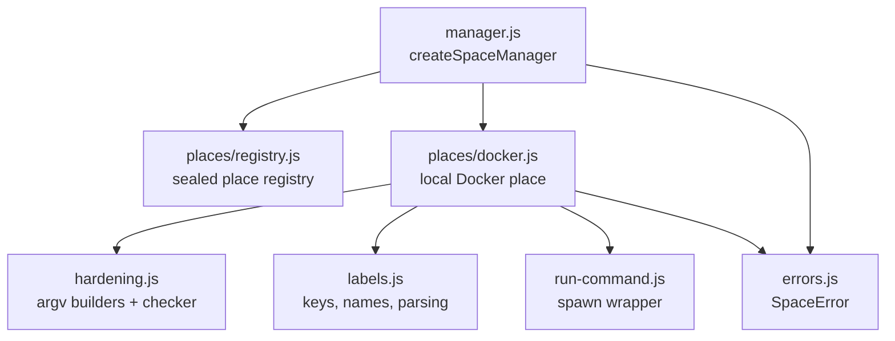
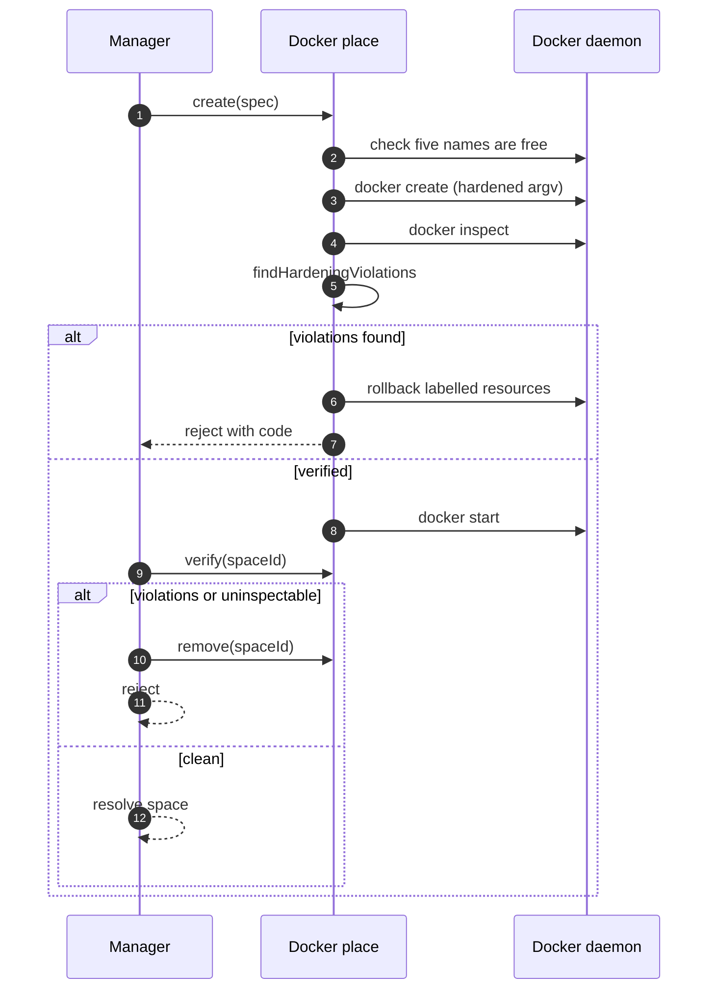

# Specification: Isolated Spaces

## Overview

Stage 1a builds the unwired backend in `packages/web/server/lib/spaces/`: a stateless space manager over a sealed place registry, with local Docker as the first place.
Every answer is read from the place at call time: there is no state file and no cache.
The Docker place shells out to the Docker CLI with a fixed hardening argv, verifies the created container against `docker inspect` before starting it, and rolls back on any failure.
Product design, words, and decisions live in `docs/isolated-spaces/DESIGN.md`; stages in `STAGES.md`; test rules in `TESTING.md`.

## Architecture

## Data Models

### Space Spec

| Field | Type | Constraints | Description |
|---|---|---|---|
| id | string | PK, 12 lowercase hex chars from `crypto.randomBytes` | Space identifier, embedded in resource names |
| name | string | not null | Display name, carried in labels only |
| project | string | not null, 16 hex chars of sha256 of project directory | Project binding for listing |
| created | string | not null, ISO time | Creation timestamp label |
| memoryBytes | number | not null, default 4 GiB | Equal `--memory` / `--memory-swap` limit |

### Space Label Set

| Field | Type | Constraints | Description |
|---|---|---|---|
| `openchamber.space` | string | always `true` | Marker label |
| `openchamber.space.id` | string | 12 hex chars | Space id |
| `openchamber.space.role` | string | `space`, `setup`, `network`, or `volume` | Resource role |
| `openchamber.space.owner` | string | installation id | Owner isolation key |
| `openchamber.space.project` | string | 16 hex chars | Project hash |
| `openchamber.space.name` | string | free text | Display name |
| `openchamber.space.created` | string | ISO time | Creation time |

Resource names are `openchamber-space-<id>-<role>[-<suffix>]`.

## API Contracts

There is no HTTP surface yet: the module is unwired and exposes a JavaScript module contract only.
No `api.yaml` is written for this specification.
The normative contract is the place contract from `packages/web/server/lib/spaces/DOCUMENTATION.md`:

| Operation | Contract |
|---|---|
| `check()` | Resolves `{ available: true, version, os, arch, hostIsolation }` or `{ available: false, code, message }`; never rejects for an expected problem |
| `create(spec)` | Resolves when the space runs and verifies clean; rejects `space_name_taken` when the id is in use; a rejected create has rolled back |
| `list()` | Resolves `[{ id, name, project, created, state, orphans, damaged, missing }]`; only reads, repairs nothing; never resolves empty on failure |
| `exec(spaceId, argv, opts)` | Runs `argv` as the space user; resolves `{ code, stdout, stderr }` for any command exit code |
| `stop(spaceId)` / `start(spaceId)` | Keep files |
| `remove(spaceId)` | Resolves `{ removed, failed }`; missing resources count as removed |
| `verify(spaceId)` | Resolves the list of `{ check, message }` violations; empty means verified |

Error codes shared across operations:

| Code | Description |
|---|---|
| `space_name_taken` | Id already in use |
| `command_timeout` / `command_killed` / `command_output_too_large` | Interrupted step; error carries `details.uncertain: true` |

## Sequences

### Create With Verify

## Technical Decisions

| Decision | Choice | Rationale |
|---|---|---|
| Docker access | Spawn the Docker CLI directly, no SDK | Full argv control, no hidden defaults, testable via injected runner |
| Source of truth | Labels on resources, no state file | Survives restarts, every answer read at call time, orphan detection falls out of listing |
| Verify timing | `docker create`, then `verify`, then `docker start` | A container that fails the check never runs; inspect of an unstarted container already has every checked field |
| Network isolation | `--internal` plus `com.docker.network.bridge.gateway_mode_ipv4=isolated` | Measured: plain `--internal` still reached host listeners via the gateway on Docker 29.2.1 |
| Base image | `node:22-bookworm` pinned by multi-arch index digest | Reproducible across linux/amd64 and linux/arm64 |
| Setup container | Root one-shot with `--network none`, `CHOWN` cap only, removes itself | Fresh volumes belong to root and the space user cannot fix that itself |
| Owner isolation | Owner installation id in every label, re-checked on inspect | Two installs sharing a daemon never touch each other's resources |

## Risks and Unknowns

1. Named volumes have no size limit: a space can fill the Docker host disk, and nothing in stage 1a prevents it.
2. Engine behavior varies (26.x silently ignores the isolated gateway option): the checker fails closed, but such engines cannot host spaces.
3. Whether a console window flashes on interactive Windows desktop sessions is unverified (`conhost.exe` child despite `windowsHide`).
4. Docker Desktop credential-helper behavior in real desktop sessions is unverified.

## Out of Scope

- HTTP routes, settings UI, and any UI surface (stage 1a is unwired).
- Gatekeeper, dispatcher, grants, and apply/discard flows (later stages per `STAGES.md`).
- `connect` from the design document.
- Places beyond local Docker (SSH Docker, Kubernetes, Apple `container`).
