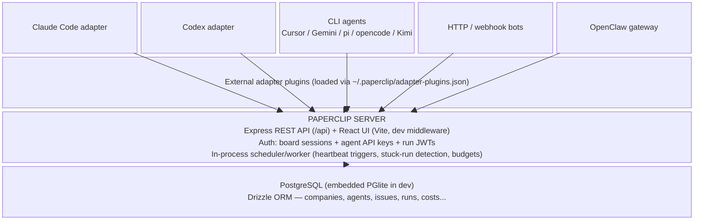
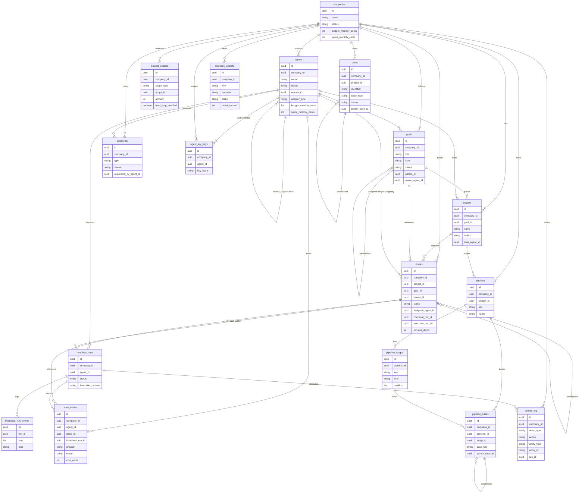

# Architecture

## System Overview

Paperclip is a single-process Node.js control plane that orchestrates externally-running AI agents.
The server hosts the REST API, serves the React UI in dev middleware mode, runs a lightweight in-process scheduler/worker, and talks to PostgreSQL (embedded PGlite in dev).
Agents never run inside Paperclip; they phone home over the API using bearer keys, and adapters translate heartbeats into whatever runtime each agent lives in.

## Entity Relationship Diagram

The full detailed database schema (types, constraints, indexes) lives in `.sdlc/context/schema.dbml`.
The diagram below shows the core domain entities and their relationships only.

## Key Components

| Component | Responsibility | Technology |
|---|---|---|
| `server/` | Express REST API, auth, orchestration services, in-process scheduler | Node.js, TypeScript, Express |
| `ui/` | Board operator interface (dashboard, org chart, tasks, approvals, costs) | React, Vite, TypeScript |
| `packages/db/` | Drizzle schema, migrations, DB clients (Postgres + embedded PGlite) | Drizzle ORM, PostgreSQL, PGlite |
| `packages/shared/` | Shared API types, constants, validators, API path constants | TypeScript |
| `packages/adapters/` | Adapter package implementations (claude-local, codex-local, cursor-local, cursor-cloud, gemini-local, grok-local, kimi-local, opencode-local, pi-local, hermes, hermes-gateway, openclaw-gateway; shared ACPX engine lives in `packages/adapter-utils/`) | TypeScript |
| `packages/adapter-utils/` | Shared adapter utilities | TypeScript |
| `packages/plugins/` | Plugin system: SDK, create-paperclip-plugin, sandbox providers, example plugins | TypeScript |
| `packages/mcp-server/` | MCP server package | TypeScript |
| `packages/skills-catalog/`, `packages/teams-catalog/` | Skills and teams catalogs | TypeScript |
| `skills/` | Paperclip runtime/operational skills (not part of the app catalog) | Markdown, scripts |
| `server/src/realtime/` | WebSocket real-time events (live dashboards, terminal sessions) | TypeScript, WebSocket |
| `server/src/services/tool-access.ts`, `tool-gateway.ts` | Third-party tool/connection integration (OAuth, MCP/SSE gateways, access policies, runtime slots) | TypeScript |
| `server/src/secrets/` | Secrets provider implementations (local-encrypted, AWS, GCP, Vault) and provider registry | TypeScript |
| `server/src/auth/` | Auth middleware (bearer token, session, board/agent resolution) | TypeScript |
| `server/src/services/pipelines.ts` | Pipeline management (stages, cases, automation, transitions, events) | TypeScript |
| `server/src/services/company-transfer-runs.ts`, `company-import-transfers.ts`, `cloud-instance.ts`, `paperclip-cloud-connector.ts` | Cross-instance company transfer/sync and Paperclip Cloud connector | TypeScript |
| `cli/` | `paperclipai` CLI (onboard, configure, plugin install) | TypeScript (tsx) |
| `doc/` | Operational and product docs (SPEC, GOAL, PRODUCT, DATABASE, DEVELOPING) | Markdown |

## Data Flow

1. A board operator creates a company, defines goals, and hires/configures agents (org tree via `reports_to`).
2. Agents authenticate with bearer API keys (hashed at rest) scoped to one company.
3. The in-process scheduler wakes agents on their heartbeat schedule (or on event triggers / @-mentions); it skips invocation when an agent is paused/terminated, a run is active, or the hard budget limit is hit.
4. The heartbeat execution service resolves workspace, injects secrets, loads skills, and invokes the agent's adapter (process spawn, HTTP call, CLI session, gateway, or external plugin).
5. Adapters stream stdout/stderr to run logs and report status; runs produce structured logs, cost events, session state, and audit trails.
6. Agents receive tasks via atomic checkout (single SQL update with `WHERE` guards), execute, write comments/documents/work products, report cost events, and delegate down the org tree (incrementing `request_depth`).
7. Cost events aggregate into per-company/agent/project/goal rollups; budget enforcement auto-pauses agents at the hard limit.
8. Every mutating action is written to `activity_log` for auditability; governance approvals gate hires and CEO strategy.

## Infrastructure

- Hosting: single-process Node.js control plane backed by PostgreSQL, with embedded PGlite as the dev default when `DATABASE_URL` is unset.
- Deployment topology: `local_trusted` (implicit board on loopback) or `authenticated` (session-based) modes with `private`/`public` exposure policy; file/object storage defaults to local disk with S3-compatible storage optional.
- Detailed technology stack, development tooling, CI/CD pipelines, environments, deployment procedures, and rollback live in `infrastructure.md`.
- Monitoring stack, alerting, and dashboards live in `observability.md`.

## Architecture Decisions

Key V1 product decisions are documented in `doc/SPEC-implementation.md` §3 (tenancy, board model, org graph shape, visibility, communication, task ownership, recovery, adapter strategy, budget period/enforcement, deployment modes).
Formal architecture/implementation decision records created during the pipeline live under `.sdlc/knowledge/decisions/`.
Notable decisions: single-tenant deployment with multi-company data model; strict tree org graph (`reports_to` nullable root); tasks+comments only (no separate chat); atomic single-assignee checkout; soft alerts + hard-limit auto-pause on monthly UTC budget window.
