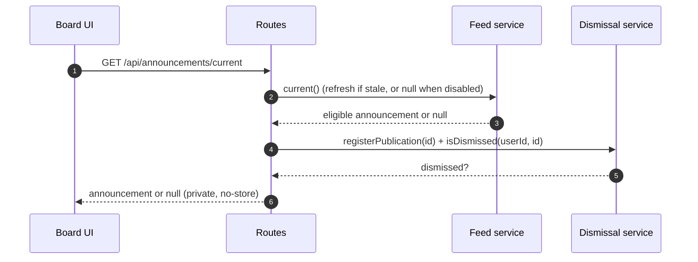

# Specification: In-app announcements

## Overview

A server-side feed service polls one versioned remote JSON manifest, validates it with strict shared zod schemas, and caches it in memory with ETag revalidation.
Routes serve the eligible current announcement and proxy its digest-verified image and sanitized animation under a sandbox CSP.
Dismissals persist as `(userId, announcementId)` rows checked on every `current` read, written idempotently inside a transaction that also appends the audit entry.
The board UI fetches the card once per tab visibility session, dismisses optimistically with local pending state, and suppresses the well under modals, toasts, or onboarding.

## Architecture

The feature spans shared contract code, two server services, board-only routes, two DB tables, and three UI pieces.
`packages/shared/src/announcements.ts` owns size caps, the animation CSP string, route allowlists, zod schemas, and the eligibility check.
`server/src/services/announcement-feed.ts` owns manifest fetching, caching, backoff, digest verification, and asset slots.
`server/src/services/announcement-animation.ts` owns DOMPurify allowlist validation of animation documents.
`server/src/services/announcements.ts` owns the publication registry, dismissal checks, and the transactional dismiss-plus-audit write.
`server/src/routes/announcements.ts` owns board-only gating, media proxying headers, and the dismiss endpoint.
`ui/src/hooks/useAnnouncement.ts` owns settling, visibility-gated fetching, optimistic dismissal, offline retry, and cross-tab sync.
`ui/src/components/AnnouncementWell.tsx` owns placement gating (identity, company, onboarding, toasts, modals).
`ui/src/components/AnnouncementCard.tsx` with `ui/src/hooks/useAnnouncementAnimation.ts` owns card rendering and sandboxed animation playback.

## Data Models

### announcement_publications

| Field | Type | Constraints | Description |
|---|---|---|---|
| announcementId | text | PK (`announcement_id`) | Validated feed ID allowlist for dismissal retries; no content, account, or interaction data |

### announcement_dismissals

| Field | Type | Constraints | Description |
|---|---|---|---|
| userId | text | PK part (`user_id`), not null | Dismissing user; no auth FK so `local-board` works |
| announcementId | text | PK part (`announcement_id`), not null | Dismissed announcement ID |
| dismissedAt | timestamp tz | not null, default now | Dismissal time (`dismissed_at`) |

Dismissals are an explicit exception to company scoping: the preference is instance-wide per user, like sidebar preferences.
Audit context still validates company membership on every dismiss write.

## API Contracts

The normative contract lives in [`api.yaml`](api.yaml) (OpenAPI 3), written alongside this document whenever the specification defines an API surface.
The table below is a summary; request/response schemas, error response bodies, and auth requirements live in `api.yaml`.

| Method | Path | Purpose |
|---|---|---|
| GET | /api/announcements/current | Return the eligible undismissed announcement or null |
| GET | /api/announcements/{id}/image | Proxy the current announcement's digest-verified image bytes |
| GET | /api/announcements/{id}/animation | Serve the sanitized animation document under sandbox CSP |
| POST | /api/announcements/{id}/dismiss | Persist the caller's dismissal with company audit context |

Error codes shared across endpoints:

| Status | Code | Description |
|---|---|---|
| 400 | INVALID_INPUT | Malformed announcement ID or strict-schema body violation |
| 401 | UNAUTHORIZED | Missing board authentication |
| 403 | FORBIDDEN | Non-board actor (e.g. agent) or missing board user context |
| 404 | NOT_FOUND | Stale media ID, unknown/inaccessible company, or invented announcement ID |

All announcement responses carry `Cache-Control: private, no-store`.

## Sequences

### Current announcement read



### Dismissal write

```mermaid
sequenceDiagram
    autonumber
    participant UI as Board UI
    participant R as Routes
    participant S as Dismissal service
    participant DB as DB
    UI->>R: POST /api/announcements/{id}/dismiss {companyId}
    R->>R: board auth + company read-membership check
    R->>S: dismiss(userId, id, companyId)
    S->>DB: BEGIN; check publication registry
    DB-->>S: known? (legacy existing rows stay idempotent)
    S->>DB: INSERT dismissal ON CONFLICT DO NOTHING
    S->>DB: INSERT activity announcement.dismissed
    DB-->>S: COMMIT (or ROLLBACK on audit failure)
    S-->>R: known (404 when invented)
    R-->>UI: 204 No Content
```

### Media proxy

```mermaid
sequenceDiagram
    autonumber
    participant UI as Board UI
    participant R as Routes
    participant F as Feed service
    participant Up as Remote host
    UI->>R: GET /api/announcements/{id}/image (or /animation)
    R->>F: asset(id, kind) via current()
    F->>F: match id + digest path; check cache/pending/cooldown
    F->>Up: GET asset (Accept by kind, no redirects, no credentials)
    Up-->>F: bytes + content-type
    F->>F: verify SHA-256 path digest; sanitize animation
    F-->>R: bytes + contentType (cached)
    R-->>UI: bytes with nosniff (+ sandbox CSP for animation)
```

## Technical Decisions

| Decision | Choice | Rationale |
|---|---|---|
| Single current announcement | Manifest carries one nullable announcement | Keeps the board surface minimal and the cache trivial |
| Strict schemas everywhere | `.strict()` on manifest, card, media, actions; unknown fields rejected | Remote-authored content must fail closed on typos or smuggled fields |
| Content-addressed assets | `assets/<sha256>.<ext>` paths with digest verification | Guarantees the proxied bytes are exactly what the feed author published |
| Publication registry | `announcement_publications` allowlist of validated IDs | Lets offline retries succeed after withdrawal while invented IDs stay 404 |
| Instance-wide dismissal preference | `(userId, announcementId)` PK without company scope | One account dismisses once across companies; audit still records company context |
| Transactional audit | Dismiss plus `announcement.dismissed` in one transaction with rollback | A dismissal without its audit entry must not exist |
| Animation as visual document only | DOMPurify allowlist plus sandbox CSP on response and srcdoc iframe | Active markup, navigation, and resource loading are rejected at two layers |
| No polling | Settle delay plus visibility-gated fetch | Optional content never churns the board during uninterrupted work |

## Risks and Unknowns

1. Feed host compromise could push hostile copy, though strict schemas, digest pinning, and sandboxing bound the blast radius to text and allowlisted visuals.
2. The in-memory manifest and asset caches do not survive restarts, so every restart refetches and the publication registry alone preserves dismissal continuity.
3. Publishing cadence and approval ownership live outside the code and need an operational owner.

## Out of Scope

- Multiple or queued announcements per feed.
- View or impression telemetry.
- Agent-facing announcement access.
- Drag-and-drop or in-app announcement authoring.
