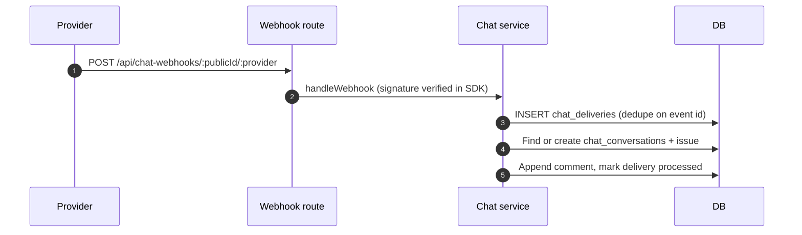
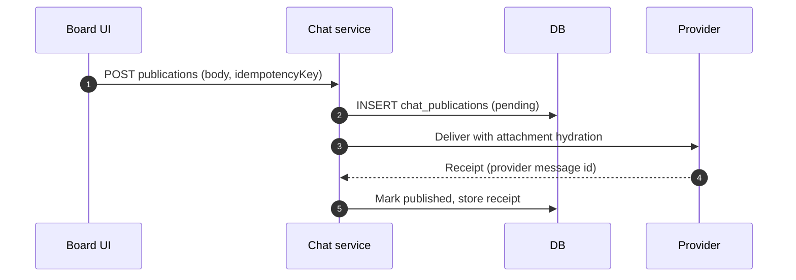
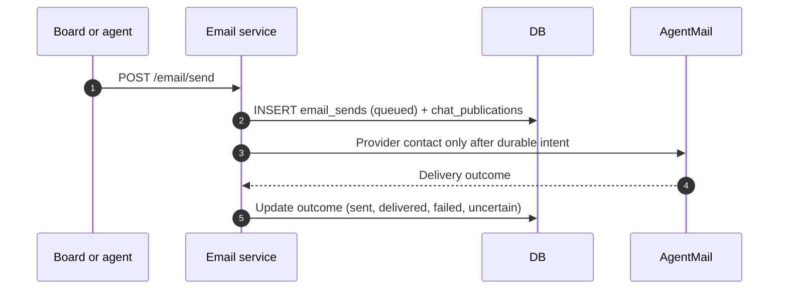
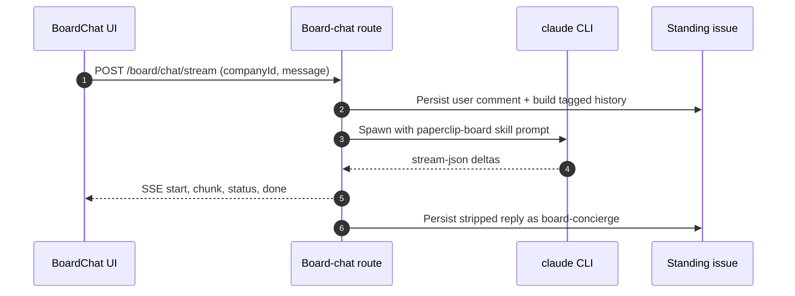

# Specification: Messaging channels

## Overview

The messaging system layers provider-specific intake and transport adapters over a shared durable core of endpoints, conversations, deliveries, and publications.
Inbound webhooks normalize provider events into deliveries that create or continue task-bound conversations under the endpoint's assigned agent.
Outbound board messages become publications with idempotency keys, receipts, retries, and attachment hydration.
Email reuses the same conversation and publication tables with email-specific state, while the Board Concierge relay stays a separate SSE path that persists to a standing issue.

## Architecture

Chat ingress and management live in `server/src/routes/chat-channels.ts:86`, with provider-authenticated webhooks mounted outside the board mutation guard in `server/src/routes/chat-channels.ts:502`.
The durable core lives in `server/src/services/chat-channels.ts`, with provider modules beside it (`server/src/services/chat-discord.ts`, `server/src/services/chat-telegram-media-intake.ts`, `server/src/services/chat-teams-file-consent.ts`, `server/src/services/photon/`).
Email routes live in `server/src/routes/email.ts:28`, with the durable pipeline in `server/src/services/email-channels.ts:117` and connection setup in `server/src/services/email-connections.ts`.
The Board Concierge relay lives in `server/src/routes/board-chat.ts:65` and streams `claude` CLI output with the `paperclip-board` skill as system prompt to `ui/src/pages/BoardChat.tsx`.
Task-facing binding summaries are derived in `server/src/services/chat-channel-binding.ts:16`, and provider deep links in `server/src/services/chat-provider-links.ts:139`.

## Data Models

### chat_endpoints

| Field | Type | Constraints | Description |
|---|---|---|---|
| id | uuid | PK, defaultRandom | Endpoint identifier |
| company_id | uuid | FK to companies, not null | Owning company |
| connection_id | uuid | FK to tool_connections, not null | Credential-holding connection |
| provider | text | not null, check (slack, github, discord, microsoft-teams, telegram, agentmail, imessage-photon) | Chat provider |
| public_id | text | not null, unique | Public webhook identifier |
| publication_mode | text | not null, default automatic, check (automatic, explicit) | Outbound gating mode |
| external_execution_policy | text | not null, default restricted, check (restricted, agent) | Execution policy for external triggers |
| assigned_agent_id | uuid | FK to agents, not null | Agent owning bound tasks |
| status | text | not null, default draft, check (draft, verifying, active, paused, attention, revoked, archived) | Lifecycle status |
| deployment_mode | text | not null, default direct, check (direct, relay) | Transport deployment |
| concurrency_policy | text | not null, default queue | Inbound concurrency handling |
| capabilities | jsonb | not null, default all-false | Provider capability flags |
| setup | jsonb | not null, default provider_setup step | Setup state machine |

DB check constraints further require one live bot identity per provider account, unique Photon numbers, and AgentMail endpoints pinned to explicit publication mode with agent policy (`packages/db/src/schema/chat_channels.ts:113`).

### chat_conversations

| Field | Type | Constraints | Description |
|---|---|---|---|
| id | uuid | PK, defaultRandom | Conversation identifier |
| company_id | uuid | FK to companies, not null | Owning company |
| endpoint_id | uuid | FK to chat_endpoints, not null | Source endpoint |
| issue_id | uuid | FK to issues, not null, restrict delete | Bound task |
| external_conversation_id | text | not null | Provider-native thread id |
| external_thread_id | text | not null, default empty | Provider-native sub-thread id |
| session_generation | integer | not null, default 1 | Rollover generation for linear threads |
| state | text | not null, default active, check (active, waiting, completed, unavailable, endpoint_removed) | Conversation state |

### chat_deliveries

| Field | Type | Constraints | Description |
|---|---|---|---|
| id | uuid | PK, defaultRandom | Delivery identifier |
| endpoint_id | uuid | FK to chat_endpoints, not null | Ingress endpoint |
| provider_event_id | text | not null, unique per endpoint | Provider event id for dedupe |
| deduplication_key | text | not null, unique per endpoint | Retry-safe dedupe key |
| event_kind | text | not null, ChatEventKind | Normalized event kind |
| state | text | not null, default received, check (received, filtered, processing, processed, retry, failed) | Intake state |
| attempts | integer | not null, default 0 | Processing attempts |
| redacted_error | text | nullable | Secret-free failure detail |
| next_attempt_at | timestamp | nullable | Next retry time |

### chat_publications

| Field | Type | Constraints | Description |
|---|---|---|---|
| id | uuid | PK, defaultRandom | Publication identifier |
| conversation_id | uuid | FK to chat_conversations, not null | Target conversation |
| issue_id | uuid | FK to issues, not null, restrict delete | Source task |
| comment_id | uuid | FK to issue_comments, nullable, set null | Source comment |
| idempotency_key | text | not null, unique per company | Replay-safe key |
| payload | jsonb | not null, SafeChatPublicationPayload | Sanitized outbound payload |
| state | text | not null, default pending, check (pending, streaming, published, retry, delivery_unknown, failed, cancelled, awaiting_consent) | Delivery state |
| provider_message_id | text | nullable | Provider receipt id |
| attempts | integer | not null, default 0 | Send attempts |

### chat_external_principals and chat_identity_links

| Field | Type | Constraints | Description |
|---|---|---|---|
| chat_external_principals | table | unique per company, provider, account, external id | Provider-native sender identities |
| chat_identity_links | table | unique per endpoint and principal, status check (pending, linked, revoked, expired) | Link intents binding principals to Paperclip users |

### email_endpoints, email_messages, and email_sends

| Field | Type | Constraints | Description |
|---|---|---|---|
| email_endpoints | table | PK endpoint_id, receive_mode check (websocket, webhook) | AgentMail transport config joined to chat_endpoints |
| email_messages | table | unique per endpoint and provider message id, direction check (inbound, outbound) | Durable correspondence rows |
| email_sends | table | PK publication_id, outcome check (queued, sent, delivered, failed, uncertain) | Durable send intents keyed by idempotency |

### Provider side tables

| Field | Type | Constraints | Description |
|---|---|---|---|
| chat_discord_command_owners | table | PK application_id, snowflake check | Instance-wide Discord application namespace tombstone with no cascading keys |
| chat_teams_file_transfers | table | phase and hash check constraints, 60MB bound | Private Teams file consent state with digests, never projected publicly |
| chat_telegram_draft_ids | sequence | non-cycling, 1 to 2147483647 | Content-free draft id allocator surviving deletion and rollback |

## API Contracts

The normative contract lives in [`api.yaml`](api.yaml) (OpenAPI 3), written alongside this document whenever the specification defines an API surface.
The table below is a summary; request/response schemas, error response bodies, and auth requirements live in `api.yaml`.

| Method | Path | Purpose |
|---|---|---|
| GET | /api/companies/:companyId/chat-endpoints | List company chat endpoints |
| POST | /api/companies/:companyId/chat-endpoints | Create a chat endpoint |
| GET | /api/chat-endpoints/:endpointId | Get endpoint detail |
| PATCH | /api/chat-endpoints/:endpointId | Update endpoint settings |
| POST | /api/chat-endpoints/:endpointId/setup | Run provider setup step |
| POST | /api/chat-endpoints/:endpointId/setup-secret | Issue a setup secret |
| POST | /api/chat-endpoints/:endpointId/test | Run endpoint health test |
| GET | /api/chat-endpoints/:endpointId/resources | List selectable provider resources |
| PUT | /api/chat-endpoints/:endpointId/resources | Replace enabled resources |
| GET | /api/chat-endpoints/:endpointId/principals | List external principals |
| POST | /api/chat-endpoints/:endpointId/principals/:principalId/link-intent | Create identity link intent |
| DELETE | /api/chat-endpoints/:endpointId/principals/:principalId/link | Revoke identity link |
| POST | /api/chat-identity-links/confirm | Confirm identity link by token |
| GET | /api/chat-endpoints/:endpointId/conversations | List endpoint conversations |
| GET | /api/chat-endpoints/:endpointId/activity | List endpoint activity with pagination |
| POST | /api/chat-endpoints/:endpointId/deliveries/:deliveryId/replay | Replay a delivery |
| POST | /api/chat-endpoints/:endpointId/publications/:publicationId/replay | Replay a publication |
| POST | /api/chat-endpoints/:endpointId/publications/:publicationId/resolve | Board-resolve a pending publication |
| POST | /api/chat-endpoints/:endpointId/actions/:actionId/resolve | Board-resolve a pending action |
| POST | /api/chat-endpoints/:endpointId/conversations/:conversationId/publications | Publish a board message or comment |
| GET | /api/chat-endpoints/:endpointId/conversations/:conversationId/publications/:publicationId/status | Get publication batch status |
| GET | /api/issues/:issueId/chat-binding | Get task chat binding summary |
| POST | /api/chat-webhooks/:publicId/:provider | Provider-authenticated inbound webhook |
| POST | /api/companies/:companyId/email/connections | Connect an AgentMail credential |
| GET | /api/companies/:companyId/email/inboxes | List email inboxes |
| POST | /api/companies/:companyId/email/inboxes | Set up an email inbox |
| POST | /api/email/inboxes/:endpointId/control | Pause, resume, or remove an inbox |
| POST | /api/email/inboxes/:endpointId/reconnect | Reconnect with a new key and mode |
| POST | /api/companies/:companyId/email/send | Queue an email send intent (202) |
| GET | /api/companies/:companyId/email/tasks/:issueId | Get the email thread for a task |
| POST | /api/chat-webhooks/agentmail/:publicId | AgentMail Svix-signed inbound webhook |
| POST | /api/board/chat/stream | Stream a Board Concierge turn over SSE |

Error codes shared across endpoints:

| Status | Code | Description |
|---|---|---|
| 400 | INVALID_INPUT | Malformed ids, bodies, or pagination parameters |
| 403 | FORBIDDEN | Missing board role, company access, or connection permission |
| 404 | NOT_FOUND | Unknown endpoint, conversation, inbox, or binding |
| 409 | CONFLICT | Reused idempotency key with different content |
| 429 | RATE_LIMITED | Webhook rate limit or board-chat concurrency cap exceeded |

## Sequences

### Inbound provider message

### Outbound board publication

### Email send intent

### Board concierge turn

## Technical Decisions

| Decision | Choice | Rationale |
|---|---|---|
| Shared durable core | Conversations, deliveries, and publications shared across chat and email | One task pipeline serves every provider with provider-specific intake only at the edges |
| Identity linking as sole authority | Telephone numbers, names, and group membership grant nothing | External identifiers are spoofable, so only an explicit confirmed link confers authority |
| Send intents before provider contact | email_sends row precedes any AgentMail call | Crash-safe exactly-once semantics with idempotency-key conflict detection |
| No implicit email | Internal task activity never sends mail | Outbound email is an explicit act with rich status cards, not a side effect |
| Action-signal stripping | %%ACTIONS%% blocks removed before persistence | UI observer signals must never pollute the durable comment body |
| Turn-tag injection guard | serializeTurn neutralizes embedded turn tags | Untrusted bodies stay inside exactly one prompt turn and cannot fabricate assistant history |
| Local-only concierge relay | Refuse non-local_trusted deployment modes | Spawning the operator CLI with skipped permissions is only safe for the machine operator |

## Risks and Unknowns

1. Photon iMessage live-provider qualification is still pending per `doc/connections/IMESSAGE-PHOTON.md`, so release readiness needs a live qualification pass.
2. Provider webhook semantics drift over time, so signature verification and event normalization need per-provider regression coverage.
3. Publication retry storms under provider outages could amplify load, so backoff and concurrency caps need load validation.

## Out of Scope

- Outbound tool-call gateway behavior, which belongs to the tools connections surface rather than conversational pipelines.
- Local Mac access, unsolicited conversations, and SMS or RCS fallback for the Photon channel.
- A separate email composer outside the normal task conversation.
