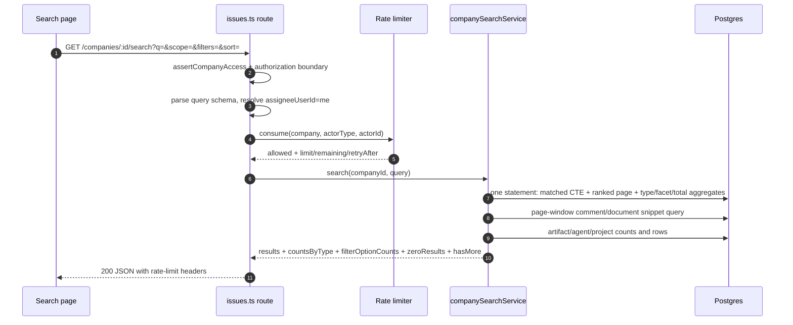
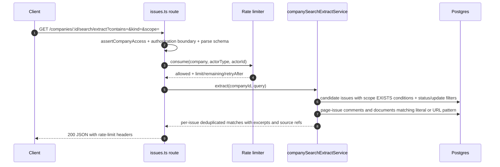

# Specification: Company/task search

## Overview

Cross-entity search is implemented as stateless services over existing Postgres rows with shared task-search SQL fragments, single-statement issue aggregation, page-window evidence enrichment, an in-memory per-actor rate limiter, and a React Search page backed by the same query schemas.
No new tables were added; ranking, snippets, facets, extract matches, and UI navigation all derive from issues, comments, documents, artifacts, agents, projects, and labels.

## Architecture

Search flows from the Search page (`ui/src/pages/Search.tsx`, 922 lines) through `ui/src/api/search.ts` to `GET /api/companies/:companyId/search` and `/search/extract` in `server/src/routes/issues.ts:7803` and `server/src/routes/issues.ts:7846`.
The route layer enforces company access, authorization boundaries, zod query parsing, `assigneeUserId=me` resolution, and rate limiting before delegating to `companySearchService` (`server/src/services/company-search.ts`) and `companySearchExtractService` (`server/src/services/company-search-extract.ts`).
Ranking and matching SQL live in `server/src/services/task-search.ts` and are shared by company search and issue-list/command-palette search.
Rate limiting is an in-memory sliding-window limiter in `server/src/services/company-search-rate-limit.ts` keyed by company, actor type, and actor id.

## Data Models

No new persistent entities were introduced.
Search reads existing rows and returns projections defined in `packages/shared/src/types/search.ts`.

### Issues (read)

| Field | Type | Constraints | Description |
|---|---|---|---|
| id | uuid | PK | Task identity returned in results |
| company_id | uuid | FK, not null | Company scope enforced on every query |
| identifier | text | nullable | Exact and prefix identifier matching |
| title | text | not null | Primary ranking and fuzzy-match field |
| description | text | nullable | Token coverage and snippet source |
| status | text | not null | Filter facet and score tiebreak |
| priority | text | not null | Priority sort and facet |
| assignee_agent_id | uuid | nullable | Filter facet |
| assignee_user_id | text | nullable | Filter facet with `me` resolution |
| project_id | uuid | nullable | Filter facet |
| updated_at | timestamptz | not null | Updated-within and sort field |

### Comments and documents (read)

| Field | Type | Constraints | Description |
|---|---|---|---|
| issue_comments.body | text | not null | Comment token matching and snippet source; soft-deleted rows excluded |
| documents.title | text | nullable | Document token matching and snippet source |
| documents.latest_body | text | nullable | Document token matching and snippet source |
| issue_documents.key | text | not null | Document anchor suffix and label |

### Agents, projects, artifacts, labels (read)

| Field | Type | Constraints | Description |
|---|---|---|---|
| agents.name/role/capabilities | text | nullable mix | Agent text matching and snippet source |
| projects.name/description | text | nullable mix | Project text matching; archived projects excluded |
| artifacts projection | view-like | via companyArtifactsService | Artifact scope results with issue and project context |
| issue_labels | join | company-scoped | Label filter facet |

### Derived flags (CTE, not stored)

| Field | Type | Constraints | Description |
|---|---|---|---|
| ident_exact/ident_starts/title_exact/title_phrase | boolean | computed | High-score ranking bands |
| title_coverage/issue_coverage/token_coverage | integer | computed | Full-coverage ranking bands |
| fuzzy_title | boolean | computed | pg_trgm and levenshtein fallback flag |
| comment_match/document_match | boolean | computed | Scope conditions and matched-field evidence |

## API Contracts

The normative contract lives in [`api.yaml`](api.yaml) (OpenAPI 3), written alongside this document whenever the specification defines an API surface.
The table below is a summary; request/response schemas, error response bodies, and auth requirements live in `api.yaml`.

| Method | Path | Purpose |
|---|---|---|
| GET | /api/companies/{companyId}/search | Cross-entity ranked search with scopes, filters, sorts, and pagination |
| GET | /api/companies/{companyId}/search/extract | Focused literal or URL match extraction with per-issue excerpts |

Error codes shared across endpoints:

| Status | Code | Description |
|---|---|---|
| 400 | INVALID_INPUT | Zod query validation failed (bad scope, status, priority, sort, pagination, extract kind) |
| 403 | FORBIDDEN | Cross-company access, authorization boundary, or `assigneeUserId=me` without board auth |
| 429 | RATE_LIMITED | Per-actor window budget exceeded with Retry-After and rate-limit headers |

Query surface for search: `q`, `scope` (all, issues, comments, documents, artifacts, agents, projects), `sort` (relevance, updated, created, priority), `limit`, `offset`, `status`, `priority`, `assigneeAgentId`, `assigneeUserId`, `projectId`, `labelId`, `updatedWithin` (24h, 7d, 30d, 90d), `updatedAfter`.
Query surface for extract: `contains` (min length, literal or URL), `kind` (literal, url), `scope` (all, issues, comments, documents), `status`, `limit`, `offset`, `matchesPerIssue`, `updatedWithin`, `updatedAfter` (mutually exclusive).

## Sequences

### Ranked search

### Extract matches

## Technical Decisions

| Decision | Choice | Rationale |
|---|---|---|
| No derived corpus | Shared CTEs over current rows with pg_trgm and levenshtein | Avoids workers and index drift while reusing existing indexes |
| Disjoint score bands | 8000 ident-exact down to 1000 fuzzy with small tiebreaks | Incidental comments, repeats, status, and recency cannot outweigh stronger match kinds |
| Single-statement aggregates | UNION ALL result page plus type, facet, and total counts | Keeps filter counts consistent with the ranked page |
| Page-window enrichment | Best comment/document snippet fetched only for fetched rows | Avoids per-match-row snippet work at scale |
| In-memory sliding window | 60 requests per 60 seconds per company plus actor key | Simple per-actor protection without new storage |
| Identifier as navigation | Copied or typed identifiers bypass fuzzy number matching | Prevents speculative numeric fuzzy hits on navigation intent |
| Short-term word anchoring | One-to-three-letter terms require word-boundary regex | Prevents UI matching inside unrelated words |
| UI deep links | Context matches open comment or document anchors; exact identifiers redirect to issue root | Preserves shown evidence while keeping identifier navigation clean |

## Risks and Unknowns

1. Fuzzy fallback relies on pg_trgm and fuzzystrmatch availability and length-bounded edit-distance work.
2. Large companies may stress the UNION ALL aggregate fan-out and cross-type merge before pagination.
3. In-memory rate limiting does not coordinate across server instances.
4. Relevance gates are corpus-based and may need retuning as task language drifts.

## Out of Scope

- Goals entity search scope (not implemented).
- Cross-company or global search.
- Regex extract queries.
- Persistent search history beyond local recent searches.
- SPEC-implementation product section for search (only OpenAPI descriptions exist).
