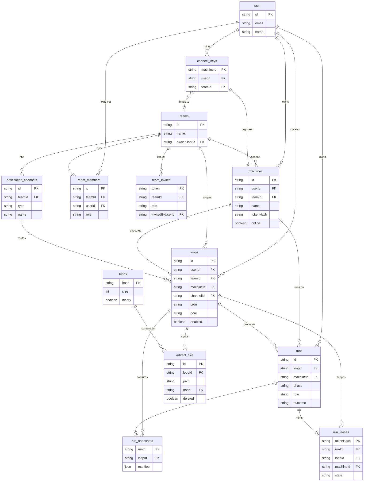

# Architecture

## System overview

Loopany is a pnpm monorepo with two packages: the server (`@loopany/server`) and the daemon (`@crewlet/loopany`). The server is a TanStack Start application that runs the UI, the in-process scheduler, the machine gateway routes, auth, and artifact storage. The daemon is one binary with two roles: a poll-loop daemon that runs on each user's machine, and the in-run `loopany` callback that the coding agent invokes during a run.

```
                        +-----------------------------------------------+
                        |           LOOPANY SERVER (zero-exec)           |
                        |  TanStack Start / Nitro / Drizzle / Postgres   |
                        |                                                |
  +-----------+         |  +--------------+   +----------------------+   |
  |   Web UI  |---------|->|  loopApi fns |   |   Scheduler (croner) |   |
  | (React,   |         |  | teamAdmin /  |   |   tick -> pending    |   |
  | dashboard,|         |  | teamFns      |   |   run -> Dispatcher  |   |
  | templates)|         |  +--------------+   +----------+-----------+   |
  +-----------+         |                               |                |
                        |                               v                |
                        |  +--------------+   +----------------------+   |
  +-----------+         |  |    Auth      |   |  MachineGateway       |   |
  | Team chat |<--------|--| Better Auth  |   |  poll/report lifecycle|   |
  | Slack/    |  push   |  | GitHub gate  |   |  + CliGateway (CLI)   |   |
  | Telegram/ |         |  +--------------+   |  + ArtifactSync (sync |   |
  | Feishu    |         |                     |    / blob PUT)        |   |
  +-----------+         |                     +-----------+-----------+   |
                        |                                 |               |
                        |  +----------------------+       | bytes         |
                        |  | DB (Drizzle):         |       |               |
                        |  | machines loops runs   |       v               |
                        |  | run_leases connect_   |   +-----------+      |
                        |  | keys teams channels   |   | BlobStore |      |
                        |  | blobs artifact_files  |   | R2 or     |      |
                        |  | run_snapshots         |   | in-memory |      |
                        |  +----------------------+   +-----------+      |
                        +-----------------------------------------------+
                                     ^   HTTP poll / report / sync
                                     |
                        +------------+------------+
                        |   DAEMON on user machine  |
                        |  poll loop (long-poll)    |
                        |  spawns coding agent      |
                        +------------+------------+
                                     |
                                     v
                        +--------------------------+
                        |  Coding agent (claude /  |
                        |  codex / grok) in a loop |
                        |  folder worktree         |
                        +--------------------------+
```

## Entity relationship diagram

Core domain entities and their relationships, mirrored from `packages/server/src/db/schema.ts` (business tables) plus the Better Auth `user` table.
The full detailed database schema (types, constraints, indexes) lives in `schema.dbml`.



## Key components

| Component | Responsibility | Technology |
|---|---|---|
| Scheduler (`src/scheduler/`) | In-process cron engine; tick creates a pending run and dispatches to the bound machine; misfire catch-up, one-shot `nextRunAt`, evolve/edit scheduling | croner, `store` |
| MachineGateway (`src/gateway/index.ts`) | Run-lifecycle core: poll/pollWait, report/reclaimRun/sweep, finishLoop, owner verbs (createLoop/listLoops/editLoop/loopLog), retention/GC, presence/watch state | TypeScript, `store` |
| CliGateway (`src/gateway/cli.ts`) | Unified `/api/machine/cli` credential router + `finalizeCli`, legacy `/agent-api/loop` dispatch, per-run verb switch, TOON rendering/help/home | TypeScript, `gateway/toon.ts` |
| ArtifactSync (`src/gateway/sync.ts`) | Manifest reconcile (`POST /api/machine/sync`), blob PUT (`PUT /api/machine/blob/:hash`), task-file mirror | TypeScript |
| BlobStore (`src/gateway/blobstore.ts`) | Content-addressed byte store shared by gateway and sync; R2-backed or in-memory | @aws-sdk/client-s3 |
| Notifier (`src/gateway/notify.ts`) | Per-channel push (telegram/slack/feishu), failure alerts, test pings; SSRF-guarded webhook fetches | TypeScript, `gateway/webhookGuard.ts` |
| Store (`src/db/store.ts`) | Drizzle data-access layer over the tiered driver; run-lifecycle writes, teams, artifacts, leases | drizzle-orm, postgres-js / @electric-sql/pglite |
| loopApi + teamAdmin (`src/server/`) | Web server functions: list jobs/machines/teams/timeline, team CRUD, notify bindings | TanStack Start server fns |
| Web UI (`src/components/`, `src/routes/`) | Dashboard, loop/run detail, timeline, machines/teams/notifications modals, compose modal, onboarding wizard, template market | React 19, Tailwind v4, Base UI, Recharts, CodeMirror |
| Daemon (`packages/daemon/src/`) | Poll-loop daemon + in-run callback; spawns the coding agent; syncs loop folders; CLI router; skill/hook installers; bin shim | Node ESM, chokidar, mcporter |
| Prompt/skill module (`src/skill/`) | All prompt/skill prose compiled into the bundle via `?raw`; public skill, templates, bundles | Markdown, `?raw` imports |

## Data flow

1. **Run lifecycle.** A scheduler tick (cron fire, one-shot `nextRunAt`, or run-now) creates a pending run row and dispatches to the loop's machine. The daemon's HTTP poll claims it (an idle daemon opts into a server-held long-poll `wait:true` ~20s hold; with a run in flight it stays the classic ~3s short poll so the progress heartbeat flows). The daemon spawns the coding agent; the agent talks back via run-token verbs (`loopany report/show/set-*/reschedule/finish`, `/agent-api/loop`); the final `report()` persists transcript/metrics/artifacts and retires the run lease. A pending run on an unreachable machine is deferred (never failed); the next cron fire supersedes a still-waiting one as `skipped`.
2. **Machine polling.** The daemon POSTs `/api/machine/poll` with its `dk_` device token, which re-stamps `machines.lastSeen`, returns pending runs to claim, the watch set (loop folders to sync), and optional server-chosen config.
3. **Artifact sync.** The daemon watcher (chokidar) builds a full sha256 manifest per loop folder and POSTs it to `/api/machine/sync` (device token); the server replies with `needHashes`; the daemon PUTs missing blobs to `/api/machine/blob/:hash` (server verifies the hash, applies per-file/per-loop caps). Bytes live in the blob store; metadata in `blobs`/`artifact_files`. `run_snapshots` capture the manifest at report for the per-run diff.
4. **Dashboard reads.** The web UI fetches through server functions (`listJobs`, `listMachines`, `listMyTeams`, `listTimeline`) with explicit team scoping; artifact bytes serve through the session-authed `/api/artifact/:loopId/*` route (inline images sandboxed).
5. **Notifications.** A run finalize or sweep reclaim fires the notifier, which pushes success/failure messages to the loop's channel; failure alerting is anti-spam (streak-based) and auto-pauses the loop after a configurable streak.

## Infrastructure

Detailed technology stack, development tooling, CI/CD pipelines, environments, deployment procedures, and rollback live in `infrastructure.md`.
Monitoring stack, alerting, and dashboards live in `observability.md`.

- Hosting: Fly.io. Staging `loopany-testing` deploys on push to `main`; production `loopany-prod` (loopany.ai) auto-promotes only after a green staging deploy (single-machine, single-scheduler invariant).
- Database: Postgres via a tiered driver. Embedded pglite when `DATABASE_URL` is unset (local/dev/tests); postgres-js on Supabase when set (pooler `:6543` for app traffic, direct `:5432` for migrations).
- Object storage: Cloudflare R2 (`LOOPANY_R2_*`) for artifact bytes; in-memory store when unset.
- CI/CD: `.github/workflows/deploy.yml` (Fly staging), `deploy-prod.yml` (prod auto-promote), `publish-daemon.yml` (npm OIDC trusted publishing on `v*` tags).
- Observability: pino structured logging; `/api/health` returns `{ok, sha, builtAt}` baked from build args; post-deploy smoke asserts the served SHA.
- Auth: Better Auth with a GitHub OAuth gate (`LOOPANY_AUTH_SECRET` required when gated); open mode (no auth) when the gate is off.

## Architecture decisions

- Zero-exec invariant: the server never runs an LLM and never executes user code; it only stores/reads bytes and computes pure functions.
- Machine connectivity is stateless HTTP polling with an opt-in server-held long-poll, not WebSocket.
- The run credential is a durable run lease (`run_leases` keyed by sha256 of the wire token) so deploys and machine sleeps never break an in-flight run's finalize.
- Machine identity derives from a device token; connect keys are stored keyed by the derived machine id, never as the key itself.
- Blob bytes live in external object storage keyed by content hash; the business DB holds only metadata.
- The scheduler is a single in-process owner; `ensureServer` guards against double boot against the same DB.
- `editLoop` and run-token `set-*` write paths share one validator module (`gateway/validate.ts`) so they cannot drift.
- The public skill is shipped via a selective whitelist copy (`sync-skill.mjs`), never a recursive copy, so internal run prompts never reach npm.
